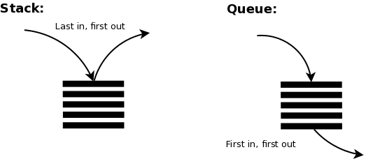
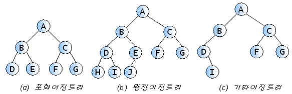
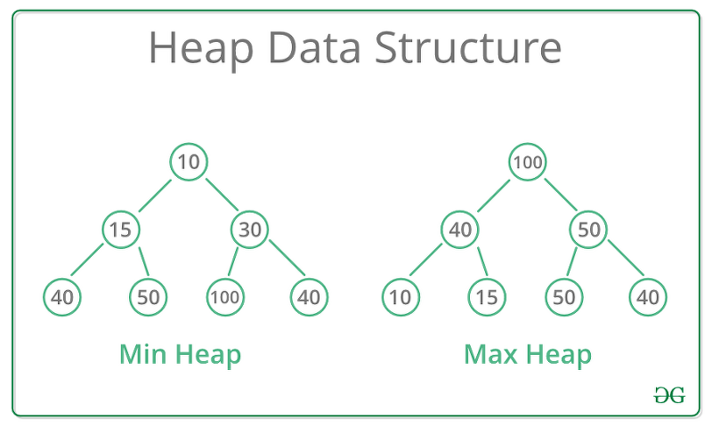

# 사견

알고리즘을 공부 안하면 SI 직행입니다. 단순코드 복붙합니다. 개발자로서 사고력을 함양할 수 없습니다.

메모리 효율적이거나 문제를 잘 해결하기 위해서는 자료구조와 알고리즘을 짝으로 알아야 합니다.

# 알고리즘

> 어떤 문제의 해결을 위하여, 입력된 자료를 토대로 하여 원하는 출력을 유도하여 내는 규칙의 집합. 여러 단계의 유한 집합으로 구성되는데, 각 단계는 하나 또는 그 이상의 연산을 필요로 한다.
>
> \- 표준국어대사전

간단하게는 문제를 해결하기 위한 유한한 절차의 합입니다.

알고리즘은 상황에 따라 효율성을 선택하는 기준이 다릅니다. 공간복잡성이 필요할 때와 시간복잡성이 필요할 때가 각각다릅니다.

자료구조와 알고르즘을 배우면 성능을 기준으로 좋은 코드와 나쁜 코드를 판단할 수 있습니다.

참고로 현업에서 일할 때는 이미 좋은 알고리즘이 다 구현되어 있습니다. 읽고 변형해서 사용하면 됩니다. 하지만 구현능력으로 개발자의 소양을 기르도록 합니다.


Algorithm Growth입니다. 알고리즘의 시간복잡성을 나타내는 Big-O 표기법 그래프입니다.

[Algorithm Analysis & Time Complexity Simplified - 미디엄 아티클 클릭하지마세요. 제한 걸려있습니다.](https://randerson112358.medium.com/algorithm-analysis-time-complexity-simplified-cd39a81fec71)

알고리즘 분석은 중요합니다. Algorithm analysis is an important part of a broader computational complexity theory, which provides theoretical estimates for the resources (space and time)needed by any algorithm which solves a given computational problem. <-- 나머지는 미래의 저가 번역해줄 것입니다.

보통 시간복잡성이라고 하면 컴퓨터가 작업을 수행한 횟수를 말합니다.

Big-O (O), Big Omega (Ω) and Big Theta (Θ)가 각각 존재합니다.

Big-O (O)는 최악의 경우 Big Omega (Ω)는 최고의 경우 Big Theta (Θ)는 최고와 최악의 평균입니다.

보통은 최악의 경우를 대응해줍니다. 하지만 현실에서 모든 최악의 경우를 대응하지는 않습니다. 대응할 때마다 발생할 수익성을 판단하고 대응합니다.

알고리즘 분석으로 모든 강의가 회귀할 것입니다. 그래서 알고리즘 분석을 대충하지 말도록 합니다. 소프트웨어 엔지니어의 수학적 소양은 기본 중 기본입니다.

사람들이 자주 착각하는 것이 있는데 자료구조와 알고리즘은 서로 독립적이지 않습니다. 서로 짝을 이룹니다.

목차

1. [과제 구현 능력](#과제-구현-능력)
2. [배열(Array)과 연결된 리스트(Linked List)](#배열과-연결된-리스트)
3. [정렬(Sort), 스택(Stack), 큐(Queue), 해쉬(Hash)](#정렬sort-스택stack-큐queue-해쉬hash)
4. [힙(heap), BFS, DFS, Dynamic Programming](#힙heap-bfs-dfs-dynamic-programming)
5. [종합 알고리즘 문제 풀이](#종합-알고리즘-문제-풀이)

## 과제 구현 능력

### 최대값 찾기

```py
def find_max_num(array):
    # 이 부분을 채워보세요!
    return 1


print("정답 = 6 / 현재 풀이 값 = ", find_max_num([3, 5, 6, 1, 2, 4]))
print("정답 = 6 / 현재 풀이 값 = ", find_max_num([6, 6, 6]))
print("정답 = 1888 / 현재 풀이 값 = ", find_max_num([6, 9, 2, 7, 1888]))
```

간단한 문제입니다. 내장함수를 사용하는 방법과 사용하지 않는 2가지 모두 구현하도록 합니다.

pep는 파이썬 스타일가이드입니다.

지정변수, 초깃값 설정 전략을 활용할 수 있습니다.

### 최빈값 찾기

`isalpha()` 문자열 메서드를 사용해서 alphabet a ~ z 대소문자 모두 해당하는 알파벳인지 파악합니다. 띄어쓰기, 특수문자, 숫자는 `False`를 반환합니다.

`ord()` 내장함수는 아스키 (ASCII) 코드의 10진값을 조회할 수 있습니다.

```py
def find_max_occurred_alphabet(string):
    # 이 부분을 채워보세요!
    return "a"

print("정답 = a 현재 풀이 값 =", find_max_occurred_alphabet("Hello my name is sparta"))
print("정답 = a 현재 풀이 값 =", find_max_occurred_alphabet("Sparta coding club"))
print("정답 = s 현재 풀이 값 =", find_max_occurred_alphabet("best of best sparta"))
```

### 시간복잡도

시간복잡도는 입력자료량과 처리시간 사이 상관관계입니다. 시간복잡도가 낮을수록 성능이 좋은 프로그램이라고 할 수 있습니다.

시간복잡도를 계산하는 방법입니다. <strong> 1줄을 연산이라고 생각하면 간단합니다. </strong> 실제로는 더 복잡할 수 있습니다. 하지만 1줄 중에 반복문은 계수로 표현합니다.

자료입력은 많은 경우 함수(메서드)인자를 주로 의미합니다.

O(N) 방식으로 표현하는 이유는 시간복잡성은 가변적인 입력자료를 받기 때문에 추상화한 것입니다.

중첩 반복문을 사용해서 문제를 해결할 수 있지만 사용하지 말아야 할 이유입니다.

```py
for num in array:              # array 의 길이만큼 아래 연산이 실행
    for compare_num in array:  # array 의 길이만큼 아래 연산이 실행
        if num < compare_num:  # 비교 연산 1번 실행
            break
    else:
        return num
```

$$
N_{num} \times N_{compare\ num}
$$

즉 하나의 $N$개의 배열 원소를 넣으면 $N^{2}$번의 연산을 합니다. $O(N^{2})$ 시간복잡성을 갖습니다. 극도로 비효율적입니다.

```py
for num in array:      # array 의 길이만큼 아래 연산이 실행
    if num > max_num:  # 비교 연산 1번 실행
        max_num = num  # 대입 연산 1번 실행
```

반면 단순 반복문은 지금 코드에서는 $O(2N)$ 시간복잡성을 갖습니다. 하지만 보통 상수는 무시합니다. 그리고 가장 높은차의 계수(이 예시의 경우 $2N$ 중 2)도 무시합니다.

시간복잡성에서 집중할 것은 차수입니다.

대부분의 경우 지불하는 비용은 공간복잡도를 지불하고 시간복잡도 성능을 개선하는데 사용합니다.

### 공간복잡도

공간복잡도는 입력자료량과 할당하는 메모리량 사이 상관관계입니다. 대부분의 경우 시간복자도가 더 중요합니다. 하지만 공간복잡도 문제도 많이 출제합니다. 시간복잡도를 먼저 공부하고 대비한 다음에 대비하기를 권장합니다.

```py
alphabet_array = ["a", "b", "c", "d", "e", "f", "g", "h", "i", "j", "k", "l", "m", "n", "o", "p", "q", "r", "s", "t", "u", "v", "x", "y", "z"]
# -> 26 개의 공간을 사용합니다
max_occurrence = 0 # 1개의 공간을 사용합니다
max_alphabet = alphabet_array[0]   # 1개의 공간을 사용합니다.

for alphabet in alphabet_array:
    occurrence = 0  # 1개의 공간을 사용합니다
```

위 코드는 모두 상수만큼의 공간복잡도를 갖습니다.

### 점근 표기법(asymptotic notation)

알고리즘의 성능을 수학적으로 표기하는 방법입니다. 알고리즘의 “효율성”을 평가하는 방법입니다. 점근 표기법(asymptotic notation)은 어떤 함수의 증가 양상을 다른 함수와의 비교로 표현하는 수론과 해석학의 방법이다.

점근 표기법은 함수의 증가양상을 간단하게 비교로 표기한 해석학과 수론의 방법론입니다.

#### 배열에서 특정 요소 찾기

```py
# Q. 다음과 같은 숫자로 이루어진 배열이 있을 때, 이 배열 내에 특정 숫자가 존재한다면 True, 존재하지 않다면 False 를 반환하시오.
def is_number_exist(number, array):
    # 이 부분을 채워보세요!
    return True


result = is_number_exist
print("정답 = True 현재 풀이 값 =", result(3,[3,5,6,1,2,4]))
print("정답 = Flase 현재 풀이 값 =", result(7,[6,6,6]))
print("정답 = True 현재 풀이 값 =", result(2,[6,9,2,7,1888]))
```

이런 알고리즘을 풀기 위해서 하는 것은 선형탐색입니다. 순서대로 값을 찾습니다. 순서대로 순회해야 합니다. 또 최악의 경우는 입력한 자료량만큼 순회해야 합니다. 이럴때는 $O(N)$에 해당합니다.

알고리즘은 입력값의 분포에 따라서 성능이 다를 수 있습니다.

알고리즘은 최악의 경우가 대부분입니다. 그래서 최악의 경우를 대응하기 위해서 $Big-O$ 표기법을 사용합니다.

### 곱하기 or 더하기

```py
# Q. 다음과 같이 0 혹은 양의 정수로만 이루어진 배열이 있을 때, 왼쪽부터 오른쪽으로 하나씩 모든 숫자를 확인하며 숫자 사이에 '✕' 혹은 '+' 연산자를 넣어 결과적으로 가장 큰 수를 구하는 프로그램을 작성하시오.

# 단, '+' 보다 '✕' 를 먼저 계산하는 일반적인 방식과는 달리, 모든 연산은 왼쪽에서 순서대로 이루어진다.
def find_max_plus_or_multiply(array):
    # 이 부분을 채워보세요!
    return 1


result = find_max_plus_or_multiply
print("정답 = 728 현재 풀이 값 =", result([0,3,5,6,1,2,4]))
print("정답 = 8820 현재 풀이 값 =", result([3,2,1,5,9,7,4]))
print("정답 = 270 현재 풀이 값 =", result([1,1,1,3,3,2,5]))
# 풀이의 시간복잡도는 무엇인가요?
```

### 반복되지 않는 문자

```py
# Q. 다음과 같이 영어로 되어 있는 문자열이 있을 때, 이 문자열에서 반복되지 않는 첫번째 문자를 반환하시오. 만약 그런 문자가 없다면 _ 를 반환하시오.
input = "abadabac"

def find_not_repeating_first_character(string):
    # 이 부분을 채워보세요!
    return "_"


result = find_not_repeating_first_character
print("정답 = d 현재 풀이 값 =", result("abadabac"))
print("정답 = c 현재 풀이 값 =", result("aabbcddd"))
print("정답 =_ 현재 풀이 값 =", result("aaaaaaaa"))
# 풀이의 시간복잡도는 무엇인가요?
```

반복의 기준이 홀수번 등장한 문자입니다.

### 숙제

#### 소수 나열하기

```py
# Q. 정수를 입력 했을 때, 그 정수 이하의 소수를 모두 반환하시오.
# 소수는 자신보다 작은 두 개의 자연수를 곱하여 만들 수 없는 1보다 큰 자연수이다.

input = 20  # output = [2, 3, 5, 7, 11, 13, 17, 19]

def find_prime_list_under_number(number):
    # 이 부분을 채워보세요!
    return []


result = find_prime_list_under_number(input)
print(result)
# 시간복잡성을 묘사하십시오.
```

```py
# Q. 0과 1로만 이루어진 문자열이 주어졌을 때, 이 문자열에 있는 모든 숫자를 전부 같게 만들려고 한다. 할 수 있는 행동은 문자열에서 연속된 하나 이상의 숫자를 잡고 모두 뒤집는 것이다. 뒤집는 것은 1을 0으로, 0을 1로 바꾸는 것을 의미한다.

# 예를 들어 S=0001100 일 때,

# 전체를 뒤집으면 1110011이 된다.
# 4번째 문자부터 5번째 문자까지 뒤집으면 1111111이 되어서 2번 만에 모두 같은 숫자로 만들 수 있다.
# 하지만, 처음부터 4번째 문자부터 5번째 문자까지 문자를 뒤집으면 한 번에 0000000이 되어서 1번 만에 모두 같은 숫자로 만들 수 있다.

# 주어진 문자열을 모두 0 혹은 모두 1로 같게 만드는 최소 횟수를 반환하시오.

input = "011110"

def find_count_to_turn_out_to_all_zero_or_all_one(string):
    # 이 부분을 채워보세요!
    return 1

result = find_count_to_turn_out_to_all_zero_or_all_one(input)
print(result)
# 시간복잡성을 묘사하십시오.
```

```py
# Q.
# 1. 입력으로 소문자의 알파벳 순으로 정렬된 문자열이 입력됩니다.
# 2. 각 알파벳은 중복이 가능합니다.
# 3. 중간에 없는 알파벳이 있을 수도 있습니다.

# 입,출력 예시와 같이 입력 문자열에 나타나는 각 알파벳의 종류,갯수를 요약하여 나타내시오.

def summarize_string(input_str):
    # 이 부분을 채워보세요!

input_str = "acccdeee"

print(summarize_string(input_str))
# 시간복잡성을 묘사하십시오.
```

## 배열(Array)과 연결된 리스트(Linked List)

자료구조마다 효율적인 알고리즘이 각각 다릅니다. 프로그램에서 문제를 해결하는 또 다른 도구입니다.

연결된 리스트는 값과 다음 노드를 지정하는 방식입니다.

### 배열

배열은 크기가 정해진 연속된 데이터의 공간(메모리)입니다. 한번 정해지면 바꿀 수 없습니다. 배열은 원소에 즉시 접근(O(1) 시간복잡성)할 수 있습니다. 배열은 원소를 중간에 삽입하면 모든 원소를 움직여야 합니다. O(N) 시간복잡성을 갖습니다. 배열은 새로운 원소를 추가하기 위해서는 새로운 모두 옮겨주어야 하기 때문에 비효율적입니다.

현실에서는 요일별 먹어야 하는 알약통과 유사합니다. 오늘이 월요일이고 수요일에 어느약을 먹기 위에 중간에 넣으려면 다른 약들을 한칸식 옮겨 주어야 합니다. 상당히 비효율적입니다.

프로그래밍에서는 보통 변수는 한번에 하나씩 움직일 수 있습니다.

### 링크드 리스트

링크드 리스트 혹은 리스트는 혼용되는 용어입니다.

리스트는 크기가 정해지지 않은 데이터의 공간입니다. 크기가 자유롭게 키울 수 있습니다. 리스트는 특정 원소를 접근하려면 O(N) 시간복잡성을 갖습니다. 연결고리는 포인터 각 데이터 칸은 노드라고 합니다. 리스트는 중간에 삽입 삭제가 쉽습니다. 포인터만 변경하면 간단하게 할 수 있습니다. O(1) 시간복잡성으로 처리할 수 있습니다.

노드는 칸에 있는 데이터 다음칸이 무엇인지 알려주는 데이터 2가지를 가져야 합니다. 이럴 때는 클래스로 구현하는 것이 좋습니다.

```py
class Node:
    def __init__(self, data) -> None:
        self.data = data  # 여기는 필요한 자료를 할당할 수 있습니다.
        self.next = None  # 처음에는 연결할 게 없습니다. 여기 속성값이 포인터 역할을 합니다.

node = Node(3)
```

하나의 노드를 생성한 상태입니다. 그래서 포인터의 값은 `None`입니다.

```py
class Node:
    def __init__(self, data) -> None:
        self.data = data  # 여기는 필요한 자료를 할당할 수 있습니다.
        self.next = None  # 처음에는 연결할 게 없습니다. 여기 속성값이 포인터 역할을 합니다.

node1 = Node(3)
node2 = Node(12)
node1.next = node2

print(node1.data)       #  3
print(node1.next.data)  # 12
```

이렇게 하면 2개의 노드를 연결한 것입니다. `node1`은 머리고 `node2`는 꼬리에 해당합니다. `print`를 보면 `node1`을 통해서만 대입했습니다.

지금 만든 자료구조에서는 HeadNode만 저장하면 됩니다. 다음 노드들은 next 메서드로 접근하면 됩니다.

```py
class Node:
    def __init__(self, data) -> None:
        self.data = data  # 여기는 필요한 자료를 할당할 수 있습니다.
        self.next = None  # 처음에는 연결할 게 없습니다. 여기 속성값이 포인터 역할을 합니다.

class LinkedList:
    def __init__(self, data):
        self.head = Node(data)  # Head 역할을 할 Node를 할당합니다.

    def append(self, data):
        # 예외처리 Head가 없는 경우 append를 하면 Head로 할당해줍니다.
        if self.head is None:
            self.head = Node(data)
            return  # 메서드의 실행을 종료시킵니다.

        # Tail에 접근(선형탐색)
        cur = self.head
        while cur.next is not None:
            cur = cur.next

        # 추가
        cur.next = Node(data)

    def printAll(self):
        if self.head is None:
            print("empty")

        cur = self.head
        while cur is not None:
            print(cur.data)
            cur = cur.next

    # 인덱스 횟수만큼 이동하기 위해 for문을 사용합니다.
    def getNode(self, index):
        cur = self.head
        if index > 0:
            for idx in range(index):
                cur = cur.next
        return cur

    # 인덱스 번째 원소를 추가합니다.
    def addNode(self, index, value):
        newNode = Node(value)
        # head를 교체할 때
        if index == 0:
            newNode.next = self.head
            self.head = newNode
            return  #실행 종료

        prevNode = self.getNode(index - 1)  # [a] -> [b] -> [c] a랑 b사이 d를 추가할 때 b 이전 a를 선택합니다.
        nextNode = prevNode.next            # [b] 노드를 기록합니다.
        prevNode.next = newNode             # [a]의 다음 노드를 [d]를 바라보게 합니다. [a] -> [b] -> none  & [b] -> [c]
        newNode.next = nextNode             # [d]는 [b]를 바라보게 합니다. [a] -> [b] -> [b] -> [c]
        return  #실행 종료

    def deleteNode(self, index):
        # [a]를 삭제할 때
        if index == 0:
            self.head = self.getNode(index+1)
            return  #실행 종료

        # [d]를 삭제할 때
        if self.getNode(index).next == None:
            self.getNode(index-1).next = None
            return  #실행 종료

        # 유스케이스
        # [a] -> [b] -> [c] -> [d] 중에서 [c]를 삭제하기 위해 [b] 선택합니다.
        prevNode = self.getNode(index-1)
        # [a] -> [b] -> [d]로 포인터를 바꿉니다. [c]는 전후관계가 없어집니다. 메모리 누수가 있는지 모르겠습니다.
        prevNode.next = prevNode.next.next

# 5 -> 12 -> 8
linkedList = LinkedList(5)
linkedList.append(12)
linkedList.append(8)

linkedList.addNode(2, 3)
linkedList.deleteNode(3)
linkedList.printAll()
```

`LinkedList`입니다.

```py
class Node:
    def __init__(self, data):
        self.data = data
        self.next = None


class LinkedList:
    def __init__(self, value):
        self.head = Node(value)

    def append(self, value):
        cur = self.head
        while cur.next is not None:
            cur = cur.next
        cur.next = Node(value)


def get_linked_list_sum(linked_list_1, linked_list_2):
    # 구현해보세요!
    return 1032


linked_list_1 = LinkedList(6)
linked_list_1.append(7)
linked_list_1.append(8)

linked_list_2 = LinkedList(3)
linked_list_2.append(5)
linked_list_2.append(4)

print(get_linked_list_sum(linked_list_1, linked_list_2))
```

`LinkedList`를 활용하는 문제입니다.

### Array vs Linked List

| 경우             | Array                                                                         | Linked List                                                  |
| ---------------- | ----------------------------------------------------------------------------- | ------------------------------------------------------------ |
| 특정 원소 조회   | O(1)                                                                          | O(N)                                                         |
| 중간에 삽입 삭제 | O(N)                                                                          | O(1)                                                         |
| 데이터 추가      | 데이터 추가 시 모든 공간이 다 차버렸다면 새로운 메모리 공간을 할당받아야 한다 | 모든 공간이 다 찼어도 맨 뒤의 노드만 동적으로 추가하면 된다. |
| 정리             | 데이터에 접근하는 경우가 빈번하다면 Array를 사용하자                          | 삽입과 삭제가 빈번하다면 LinkedList를 사용하는 것이 더 좋다. |

### 파이썬의 List

파이썬의 `list` 자료형은 배열로 구현되어 있습니다. 하지만 내부적으로 동적배열로 설계되어 있습니다. 파이썬은 Linked List, Array 모두 사용할 수 있습니다.

### 파이썬 클래스 다루기

클래스는 속성과 기능을 가진 객체를 총칭하는 개념입니다.

```py
class person:
    pass

jakeTheDog = person()
print(jakeTheDog)  # <__main__.person object at 0x1049c0a60>
```

`0x1049c0a60`은 메모리 주소입니다.

`person()`은 생성자 함수입니다. 함수가 실행되면 객체를 생성해줍니다. 그리고 `jakeTheDog` 식별자에 객체가 할당 되어 있습니다.

```py
class person:
    def __init__(self, name):  # 초기화 함수입니다. 생성자함수에 인자를 받아야 합니다.
        self.name = name  # 생성하면서 갖게 된 속성값입니다.
        print()

    def take(self):  # 메서드입니다. 메서드에는 첫번째 매개변수는 self여야 합니다.
        print('You stay away from my women! magic men')


jakeTheDog = person('jake')  # jakeTheDog 인스턴스를 생성한 것입니다.
print(jakeTheDog)  # <__main__.person object at 0x1049c0a60>
```

## 이진탐색과 선형탐색

소주게임 병뚜껑의 숫자를 맞추는 술게임 업다운이 있습니다. 대표적인 이진탐색 알고리즘을 실생활에 사용하는 경우입니다. 업다운은 알고리즘에서 어느것이 더 가까운지 알 수 있기 때문에 가운데를 찍고 맞췄는지 큰자 작은지 알아낼 수 있기 때문에 효율적입니다.

```py
finding_target = 14
finding_numbers = [1, 2, 3, 4, 5, 6, 7, 8, 9, 10, 11, 12, 13, 14, 15, 16]


def is_existing_target_number_binary(target, array):
    # 구현해보세요!
    return False


result = is_existing_target_number_binary(finding_target, finding_numbers)
print(result)
```

선형탐색은 $O(N)$ 시간복잡성을 갖습니다. 하지만 이진탐색은 $O(logN)$ 시간복잡성을 갖습니다.

이진탐색은 자료가 정렬되어 있어야 합니다.

## 재귀함수 Recursion

재귀함수는 자기자신을 반복적으로 호출하는 함수를 보고 재귀함수라고 합니다.

재귀함수를 활용하면 간략하고 효율적인 코드를 작성할 수 있습니다.

```py
def count_down(number):
    if number == 0: return
    print(number)          # number를 출력하고
    count_down(number - 1) # count_down 함수를 number - 1 인자를 주고 다시 호출한다!


count_down(60)
```

위코드는 재귀함수입니다. 재귀함수는 항상 베이스케이스 즉 종료조건부터 정의하고 다른 코드로 종료 조건을 유도하는 방식으로 작성합니다.

피보나치, 팩토리얼함수 등 구현하기 좋은 연습들이 존재합니다.

```py
def factorial(n):
    # 이 부분을 채워보세요!
    return 120

print(factorial(5))
```

베이스 케이스를 보고 특정숫자로 떨어지는 조건입니다.

회문은 일요일, 오디오, 토마토처럼 앞뒤로 똑같은 단어를 보고 하는 말입니다.

```py
input = "abcba"

def is_palindrome(string):
    return True

print(is_palindrome(input))
```

## 숙제

```py
# Q. 링크드 리스트의 끝에서 K번째 값을 반환하시오.
class Node:
    def __init__(self, data):
        self.data = data
        self.next = None


class LinkedList:
    def __init__(self, value):
        self.head = Node(value)

    def append(self, value):
        cur = self.head
        while cur.next is not None:
            cur = cur.next
        cur.next = Node(value)

    def get_kth_node_from_last(self, k):
        # 구현해보세요!
        return self.head


linked_list = LinkedList(6)
linked_list.append(7)
linked_list.append(8)

print(linked_list.get_kth_node_from_last(2).data)  # 7이 나와야 합니다!
```

단순히 코드를 읽는 것만으로 시간복잡도를 추정하는 것은 옳지 않습니다. 컴퓨터가 표시하는 연산량을 신뢰하는 것이 더 좋습니다.

```py
'''
Q. 배달의 민족 서버 개발자로 입사했다.
상점에서 현재 가능한 메뉴가 ["떡볶이", "만두", "오뎅", "사이다", "콜라"] 일 때, 유저가 ["오뎅", "콜라", "만두"] 를 주문했다.

그렇다면, 현재 주문 가능한 상태인지 여부를 반환하시오.
'''
shop_menus = ["만두", "떡볶이", "오뎅", "사이다", "콜라"]
shop_orders = ["오뎅", "콜라", "만두"]


def is_available_to_order(menus, orders):
    # 이 부분을 채워보세요!
    return True


result = is_available_to_order(shop_menus, shop_orders)
print(result)
```

대부분의 정렬은 $O(N \cdot logN)$ 시간복잡도를 찾습니다.

중복없는 존재여부를 확인할 때는 집합(Set)으로 접근해볼 수 있습니다.

위문제를 이진탐색으로 풀어볼 수 있지만 집합연산을 활용하면 더욱더 우아하게 풀 수 있습니다. 오히려 이런 경우에는 이진탐색이 비효율적입니다.

이진탐색이 항상 효율적인 것이 아닙니다. 상황에 따라 효율이 다릅니다.

```py
'''
Q. 음이 아닌 정수들로 이루어진 배열이 있다. 이 수를 적절히 더하거나 빼서 특정한 숫자를 만들려고 한다. 예를 들어 [1, 1, 1, 1, 1]로 숫자 3을 만들기 위해서는 다음 다섯 방법을 쓸 수 있다.

-1+1+1+1+1 = 3
+1-1+1+1+1 = 3
+1+1-1+1+1 = 3
+1+1+1-1+1 = 3
+1+1+1+1-1 = 3

사용할 수 있는 숫자가 담긴 배열 numbers, 타겟 넘버 target_number이 매개변수로 주어질 때 숫자를 적절히 더하고 빼서 타겟 넘버를 만드는 방법의 수를 반환하시오.
'''
numbers = [1, 1, 1, 1, 1]
target_number = 3

def get_count_of_ways_to_target_by_doing_plus_or_minus(array, target):
    # 구현해보세요!
    return 5

print(get_count_of_ways_to_target_by_doing_plus_or_minus(numbers, target_number))  # 5를 반환해야 합니다!
```

문제의 경우의 수가 너무 크면 경우의 수를 축소하는 전략도 하나의 방법입니다.

경우의 수 문제는 $k^{n}$으로 접근해야 합니다.

파이썬에서는 함수에 원시형 자료를 받으면 복제하고 실행합니다. 사이드 이펙트를 막는 설계 같습니다.

함수에서 외부 자료를 변형하고 싶으면 `global` 키워드를 사용합니다.

## 정렬(Sort), 스택(Stack), 큐(Queue), 해쉬(Hash)

스택과 큐는 입출력이 정해진 자료구조입니다. 스택은 LIFO 큐는 FIFO입니다.

해쉬는 해쉬알고리즘으로 문자열을 고정된 길의 데이터를 만들 수 있습니다. 딕셔너리를 만들 때 사용할 수 있습니다. 블록체인에서 활용합니다.

### 정렬

정렬이란 데이터를 순서대로 나열하는 방법을 말합니다. 정렬은 다양한 전략들이 존재합니다.

정렬은 알고리즘에서 중요합니다. 이진탐색도 가능하고 데이터를 효율적으로 탐색할 수 있습니다.

정렬은 말로 표현하기 어려울 것입니다.

#### 버블정렬

가장 쉽고 직관적인 정렬방법입니다.

배열에서 2개식 읽으면서 순회합니다. 비교하고 조건에 따라 교환합니다. 오름차순이면 앞이 더 크면 교환합니다. 하지만 상당히 비효율적입니다.

```py
# 변수교환 문법
a = 2
b = 3
a, b = b, a
print(a, b)
```

```py
input = [4, 6, 2, 9, 1]

def bubble_sort(array):
    # 이 부분을 채워보세요!
    return array

bubble_sort(input)
print(input)  # [1, 2, 4, 6, 9] 가 되어야 합니다!

print("정답 = [1, 2, 4, 6, 9] / 현재 풀이 값 = ",bubble_sort([4, 6, 2, 9, 1]))
print("정답 = [-1, 3, 9, 17] / 현재 풀이 값 = ",bubble_sort([3,-1,17,9]))
print("정답 = [-3, 32, 44, 56, 100] / 현재 풀이 값 = ",bubble_sort([100,56,-3,32,44]))
```

이 알고리즘이 순회하는 방식은 비효율적일 것입니다.

1, 2, 3, 4, 5
1, 2, 3, 4
1, 2, 3
1, 2
1

이런 역삼각형 방식으로 순회하게 될 것입니다. $O(N^{2})$ 시간복잡성을 갖습니다.

#### 선택정렬

선택정렬은 이름처럼 선택하고 정렬하는 방식입니다.

```py
input = [4, 6, 2, 9, 1]


def selection_sort(array):
    # 이 부분을 채워보세요!
    return


selection_sort(input)
print(input) # [1, 2, 4, 6, 9] 가 되어야 합니다!

print("정답 = [1, 2, 4, 6, 9] / 현재 풀이 값 = ",selection_sort([4, 6, 2, 9, 1]))
print("정답 = [-1, 3, 9, 17] / 현재 풀이 값 = ",selection_sort([3,-1,17,9]))
print("정답 = [-3, 32, 44, 56, 100] / 현재 풀이 값 = ",selection_sort([100,56,-3,32,44]))
```

#### 삽입정렬

삽입정렬은 현재 정렬된 배열과 아닌 배열로 나눕니다. 보통 앞에 첫번째는 정렬된 것으로 봅니다. 다음 두번째 부터 삽입하고 비교합니다.

삽입정렬은 정렬된 배열에 새로운 원소를 배치하고 정렬하는 방식입니다.

```py
input = [4, 6, 2, 9, 1]

def insertion_sort(array):
    # 이 부분을 채워보세요!
    return

insertion_sort(input)
print(input) # [1, 2, 4, 6, 9] 가 되어야 합니다!

print("정답 = [4, 5, 7, 7, 8] / 현재 풀이 값 = ",insertion_sort([5,8,4,7,7]))
print("정답 = [-1, 3, 9, 17] / 현재 풀이 값 = ",insertion_sort([3,-1,17,9]))
print("정답 = [-3, 32, 44, 56, 100] / 현재 풀이 값 = ",insertion_sort([100,56,-3,32,44]))
```

#### 병합정렬

기술면접 질문의 수준입니다.

병합정렬은 배열의 앞부분과 뒷부분 그룹을 나누어 각각 정렬후 병합하는 알고리즘입니다.

```py
array_a = [1, 2, 3, 5]
array_b = [4, 6, 7, 8]

def merge(array1: list, array2: list):
    # 이 부분을 채워보세요!
    return

print(merge(array_a, array_b))  # [1, 2, 3, 4, 5, 6, 7, 8] 가 되어야 합니다!

print("정답 = [-7, -1, 5, 6, 9, 10, 11, 40] / 현재 풀이 값 = ", merge([-7, -1, 9, 40], [5, 6, 10, 11]))
print("정답 = [-1, 2, 3, 5, 10, 40, 78, 100] / 현재 풀이 값 = ", merge([-1,2,3,5,40], [10,78,100]))
print("정답 = [-1, -1, 0, 1, 6, 9, 10] / 현재 풀이 값 = ", merge([-1,-1,0], [1, 6, 9, 10]))
```

#### 분할정복 2 - 분할정복(Divide and Conquer)

merge sort

[3, 2, 4, 1]

이런 배열이 있으면 이 배열을 분할하고 정렬하고 합치는 전략입니다.

[3, 2],[4, 1]
[2, 3],[1, 4]

```py
array = [5, 3, 2, 1, 6, 8, 7, 4]

def merge_sort(array):
    if len(array) <= 1: return array
    mid = len(array)//2
    left_array = merge_sort(array[mid:])
    right_array = merge_sort(array[:mid])
    return merge(left_array, right_array)

def merge(array1: list, array2: list):
    mergeArray = []
    array2Index = 0
    array1Index = 0
    while array1Index < len(array1) and array2Index < len(array2):
        if array1[array1Index] < array2[array2Index]:
            mergeArray.append(array1[array1Index])
            array1Index += 1
        else:
            mergeArray.append(array2[array2Index])
            array2Index += 1

    # 남는 원소 처리
    while array1Index < len(array1):
        mergeArray.append(array1[array1Index])
        array1Index += 1

    while array2Index < len(array1):
        mergeArray.append(array1[array2Index])
        array2Index += 1

    return mergeArray

print(merge_sort(array))  # [1, 2, 3, 4, 5, 6, 7, 8] 가 되어야 합니다!

print("정답 = [-7, -1, 5, 6, 9, 10, 11, 40] / 현재 풀이 값 = ", merge_sort([-7, -1, 9, 40, 5, 6, 10, 11]))
print("정답 = [-1, 2, 3, 5, 10, 40, 78, 100] / 현재 풀이 값 = ", merge_sort([-1, 2, 3, 5, 40, 10, 78, 100]))
print("정답 = [-1, -1, 0, 1, 6, 9, 10] / 현재 풀이 값 = ", merge_sort([-1, -1, 0, 1, 6, 9, 10]))
```

하나의 함수가 다른 함수에 의존성을 갖은 시간복잡성을 갖고 있습니다.

`merge`함수는 $O(N)$ 선형시간복잡성을 갖습니다.

`merge_sort`는 $O(N \cdot logN)$ 시간복잡성을 갖습니다. ~~ 정확히 알고 있는 것은 아닙니다. 재귀함수로 배열의 반을 연속해서 호출하기 때문에 logN 시간복잡성을 갖습니다.~~

### 스택 Stack



스택은 LIFO 형태의 자료구조입니다. 늦게 있으면 가장 위에 있는 개념입니다. 가장 위에 있어서 가장 먼저 뺄 수 있습니다. `Cmd` + `Z`같은 되돌리기 명령에 활용할 수 있습니다.

자료구조는 여러번 구현시도를 해야합니다.

```py
class Node:
    def __init__(self, data):
        self.data = data
        self.next = None

class Stack:
    def __init__(self):
        self.head = None

    def push(self, value):
        newStack = Node(value)
        newStack.next = self.head
        self.head = newStack

    # pop 기능 구현
    def pop(self):
        if self.is_empty(): return 'Stack은 비어있습니다.'
        # self.head를 조회합니다.
        stackPop = self.head
        # self.head를 삭제합니다.
        self.head = self.head.next
        return stackPop

    def peek(self):
        return self.head

    def is_empty(self):
        return self.head is None

stack = Stack()
stack.push(10)
stack.push(20)
stack.push(30)
print(stack.peek().data) # 30
print(stack.pop().data)  # 30
print(stack.pop().data)  # 20
print(stack.peek().data) # 10
```

스택을 직접 구현할 수 있지만 파이썬 자료형의 메서드를 활용해서 동일한 기능을 구현할 수 있습니다.

```py
stack = []            # 빈 스택 초기화
stack.append(4)       # 스택 push(4)
stack.append(3)       # 스택 push(3)
top = stack.pop()     # 스택 pop
print(top)            # 3!
```

연습문제입니다.

```py
'''
[6, 9, 5, 7, 4] # 라고 입력된다면,

# 아래 그림처럼 탑이 있다고 보시면 됩니다!
<- <- <- <- <- 레이저의 방향
   I
   I
   I     I
I  I     I
I  I  I  I
I  I  I  I  I
I  I  I  I  I
I  I  I  I  I
I  I  I  I  I

[0, 0, 2, 2, 4] # 다음과 같이 반환하시면 됩니다!
'''
top_heights = [6, 9, 5, 7, 4]


def get_receiver_top_orders(heights):
    return


print(get_receiver_top_orders(top_heights))  # [0, 0, 2, 2, 4] 가 반환되어야 한다!

print("정답 = [0, 0, 2, 2, 4] / 현재 풀이 값 = ",get_receiver_top_orders([6,9,5,7,4]))
print("정답 = [0, 0, 0, 3, 3, 3, 6] / 현재 풀이 값 = ",get_receiver_top_orders([3,9,9,3,5,7,2]))
print("정답 = [0, 0, 2, 0, 0, 5, 6] / 현재 풀이 값 = ",get_receiver_top_orders([1,5,3,6,7,6,5]))
# 시간복잡성을 묘사하십시오.
# O(N^2)
```

함수에서 받은 인자 자체를 `Stack`으로 취급해야 합니다.

### 큐 Queue


한쪽에 데이터를 넣고 반대로 빼는 자료구조입니다. FIFO 혹은 선입선출 구조라고 합니다.

순서대로 처리해야 하는 일들에 사용합니다. 주문처리도 좋은 예시입니다.

큐는 링크드 리스트를 응용합니다. 처음과 끝 노드 모두 구현해야 합니다.

```py
class Node:
    def __init__(self, data):
        self.data = data
        self.next = None

class Queue:
    def __init__(self):
        self.head = None
        self.tail = None

    def enqueue(self, value):
        newNode = Node(value)
        if self.is_empty():
            self.tail = newNode
            self.head = newNode
            return  # 실행종료

        newNode.next = self.tail
        self.tail = newNode

    def dequeue(self):
        if self.is_empty(): return 'empty'
        queuePop = self.head
        self.head = self.head.next
        return queuePop.data

    def peek(self):
        return self.head.data

    def is_empty(self):
        return self.head == None and self.tail == None
```

`head`를 먼저 뽑는 것이 올바릅니다. `head`가 밀리고 뽑을 때 나오게 됩니다. 자료를 적재할 때 가장 최근에 쌓인 자료는 `tail`에 있게 됩니다. 가장 마지막에 쌓인 자료는 `head`에 있게 됩니다.

```py
queue = [4, 5, 6]
queue.insert(0, 3)
queue.insert(0, 2)
print(queue)        # [2, 3, 4, 5, 6]
print(queue.pop())  # 6
print(queue.pop())  # 5
print(queue)        # [2, 3, 4]
```

### 해쉬

.png>)

컴퓨팅에서 키를 값에 매핑할 수 있는 구조인, 연관 배열 추가에 사용되는 자료 구조입니다. 해시 테이블은 해시 함수를 사용하여 색인(index)을 버킷(bucket)이나 슬롯(slot)의 배열로 계산합니다. 데이터를 다루는 기법 중에 하나로 데이터의 검색과 저장이 아주 빠릅니다.

파이썬의 딕셔너리랑 해쉬테이블과 유사한 자료구조입니다. 하지만 파이썬은 내부적으로 배열로 만듭니다.

본래 해쉬테이블은 키만 검색하면 되기 때문에 탐색 성능이 좋습니다.

파이썬에는 놀랍게도 해쉬함수를 제공합니다. `hash(object)` 내장함수입니다. 이 내장함수는 항상 임의의 값을 돌려줍니다.

해쉬테이블의 탐색시간이 $O(1)$ 시간복잡성을 갖습니다.

```py
class Dict:
    def __init__(self):
        self.items = [None] * 8

    def put(self, key, value):
        self.items[hash(key) % 8] = value
        return

    def get(self, key):
        return self.items[hash(key) % 8]
```

파이썬에서 DIY로 만든 `hash`입니다. `hash`내장함수는 `8`로 나누면 나머지(`%`)가 `0 ~ 7`이 나옵니다. 하지만 난수이기 때문에 덮어쓰기 충돌이 발생할 수 있습니다.

덮어쓰기 충돌을 막아야 합니다. 링크드 리스트를 활용하는 것도 전략입니다.

파이썬에서는 `tuple`자료형을 활용하는 전략이 있습니다.

```py
class LinkedTuple:
    def __init__(self):
        self.items = []

    def add(self, key, value):
        self.items.append((key, value))

    def get(self, key):
        for k, v in self.items:
            if k == key:
                return v
```

`tuple` 자료형은 불변입니다. 이 클래스는 덮어쓰기 문제가 없어집니다.

```py
class LinkedTuple:
    def __init__(self):
        self.items = []

    def add(self, key, value):
        self.items.append((key, value))

    def get(self, key):
        for k, v in self.items:
            if k == key:
                return v

class LinkedDict:
    def __init__(self):
        self.items = []
        for i in range(8):
            self.items.append(LinkedTuple())

    def put(self, key, value):
        self.items[hash(key) % len(self.items)].add(key, value)

    def get(self, key):
        return self.items[hash(key) % len(self.items)].get(key)


linkedDict = LinkedDict()
linkedDict.put('fast', '빠른')
linkedDict.get('fast')
```

이런 해결방식을 보고 체이닝이라고 부릅니다.

다른 방법은 배열의 다음 남는 공간에 담는 방법도 있습니다.

해쉬테이블은 키와 데이터를 저장하고 키로 데이터를 조회하는 방법입니다. 파이썬 딕셔너리 사용법과 동일합니다.

해쉬함수는 임의의 길이를 갖는 메시지를 입력해서 고정된 길의 임의의 값을 출력하는 함수입니다.

해쉬테이블의 검색은 $O(1)$상수시간복잡성을 갖습니다.

체이닝은 링크드 리스트 방식으로 해결할 수 있습니다. 개방주소법은 비어있을 때 체우는 방식입니다.

```py
'''
Q. 오늘 수업에 많은 학생들이 참여했습니다. 단 한 명의 학생을 제외하고는 모든 학생이 출석했습니다.

모든 학생의 이름이 담긴 배열과 출석한 학생들의 배열이 주어질 때, 출석하지 않은 학생의 이름을 반환하시오.
'''
all_students = ["나연", "정연", "모모", "사나", "지효", "미나", "다현", "채영", "쯔위"]
present_students = ["정연", "모모", "채영", "쯔위", "사나", "나연", "미나", "다현"]


def get_absent_student(all_array, present_array):
    # 구현해보세요!
    return


print(get_absent_student(all_students, present_students))

print("정답 = 예지 / 현재 풀이 값 = ",get_absent_student(["류진","예지","채령","리아","유나"],["리아","류진","채령","유나"]))
print("정답 = RM / 현재 풀이 값 = ",get_absent_student(["정국","진","뷔","슈가","지민","RM"],["뷔","정국","지민","진","슈가"]))
```

해쉬테이블은 검색이 효율적이지만 공간사용량이 많은 자료구조입니다.

### 숙제

```py
'''
Q.
다음과 같이 숫자로 이루어진 배열이 두 개가 있다.
하나는 상품의 가격을 담은 배열이고, 하나는 쿠폰을 담은 배열이다.
쿠폰의 할인율에 따라 상품의 가격을 할인 받을 수 있다.
이 때, 최대한 할인을 많이 받는다면 얼마를 내야 하는가?
단, 할인쿠폰은 한 제품에 한 번씩만 적용 가능하다.
'''
shop_prices = [30000, 2000, 1500000]
user_coupons = [20, 40]

def get_max_discounted_price(prices, coupons):
    # 이 곳을 채워보세요!
    return 0

print("정답 = 926000 / 현재 풀이 값 = ", get_max_discounted_price([30000, 2000, 1500000], [20, 40]))
print("정답 = 485000 / 현재 풀이 값 = ", get_max_discounted_price([50000, 1500000], [10, 70, 30, 20]))
print("정답 = 1550000 / 현재 풀이 값 = ", get_max_discounted_price([50000, 1500000], []))
print("정답 = 1458000 / 현재 풀이 값 = ", get_max_discounted_price([20000, 100000, 1500000], [10, 10, 10]))
```

```py
'''
Q. 괄호가 바르게 짝지어졌다는 것은 '(' 문자로 열렸으면 반드시 짝지어서 ')' 문자로 닫혀야 한다는 뜻이다. 예를 들어

()() 또는 (())() 는 올바르다.
)()( 또는 (()( 는 올바르지 않다.

이 때, '(' 또는 ')' 로만 이루어진 문자열 s가 주어졌을 때, 문자열 s가 올바른 괄호이면 True 를 반환하고 아니라면 False 를 반환하시오.
'''
def is_correct_parenthesis(string):
    # 구현해보세요!
    return


print("정답 = True / 현재 풀이 값 = ", is_correct_parenthesis("(())"))
print("정답 = False / 현재 풀이 값 = ", is_correct_parenthesis(")"))
print("정답 = False / 현재 풀이 값 = ", is_correct_parenthesis("((())))"))
print("정답 = False / 현재 풀이 값 = ", is_correct_parenthesis("())()"))
print("정답 = False / 현재 풀이 값 = ", is_correct_parenthesis("((())"))
```

```py
'''
Q. 멜론에서 장르 별로 가장 많이 재생된 노래를 두 개씩 모아 베스트 앨범을 출시하려 한다.

노래는 인덱스 구분하며, 노래를 수록하는 기준은 다음과 같다.

1. 속한 노래가 많이 재생된 장르를 먼저 수록한다. (단, 각 장르에 속한 노래의재생 수 총합은 모두 다르다.)

2. 장르 내에서 많이 재생된 노래를 먼저 수록한다.

3. 장르 내에서 재생 횟수가 같은 노래 중에서는 고유 번호가 낮은 노래를 먼저 수록한다.


노래의 장르를 나타내는 문자열 배열 genres와
노래별 재생 횟수를 나타내는 정수 배열 plays가 주어질 때,

베스트 앨범에 들어갈 노래의 인덱스를 순서대로 반환하시오.
'''
def get_melon_best_album(genre_array, play_array):
    # 구현해보세요!
    return []


print("정답 = [4, 1, 3, 0] / 현재 풀이 값 = ", get_melon_best_album(["classic", "pop", "classic", "classic", "pop"], [500, 600, 150, 800, 2500]))
print("정답 = [0, 6, 5, 2, 4, 1] / 현재 풀이 값 = ", get_melon_best_album(["hiphop", "classic", "pop", "classic", "classic", "pop", "hiphop"], [2000, 500, 600, 150, 800, 2500, 2000]))
```

## 힙(heap), BFS, DFS, Dynamic Programming

여기까지는 알고리즘 개념입니다. 다음주는 풀이입니다.

### 트리


Node: 트리에서 데이터를 저장하는 기본 요소
Root Node: 트리 맨 위에 있는 노드
Level: 최상위 노드를 Level 0으로 하였을 때, 하위 Branch로 연결된 노드의 깊이를 나타냄
Parent Node: 어떤 노드의 상위 레벨에 연결된 노드
Child Node: 어떤 노드의 하위 레벨에 연결된 노드
Leaf Node(Terminal Node): Child Node가 하나도 없는 노드
Sibling: 동일한 Parent Node를 가진 노드
Depth: 트리에서 Node가 가질 수 있는 최대 Level

트리는 비선형 구조입니다. `Queue`, `Stack`, `Linked List` 등 데이터를 순차적으로 나열한 자료구조를 보고 선형 구조라고 합니다. 그럼 비선형 구조는 순차적으로 나열한 구조가 아닌 것입니다.

트리구조는 계층구조를 가진 망입니다. 계층형과 비선형이라는 특징이 중요합니다.

선형구조는 자료를 저장하고 불러오는데 초점이 맞추어졌습니다.

비선형구조는 표현에 초점이 맞추어졌습니다. 컴퓨터의 파일 디렉토리가 해당합니다.

트리는 그냥 트리만 존재하지 않습니다. 이진 트리, 이진 탐색 트리, 균형 트리(AVL 트리, red-black 트리), 이진 힙(최대힙, 최소힙) 등이 존재합니다. 여기서는 이진 트리와 이진 완성 트리만 배웁니다.

트리는 `Linked List`랑 유사하게 `Node`에 데이터를 저장합니다.

#### 이진 트리(Binary Tree)와 완전 이진 트리(Complete Binary Tree)

이진트리는 각 노드당 자식은 최대 2개를 갖을 수 있습니다. 0, 1, 2만 자식 노드의 개수로 갖을 수 있습니다.



이진트리는 왼쪽 노드부터 채워야 완전한 이진트리가 될 수 있습니다.

놀랍게도 완전 이진 트리는 배열로 표현할 수 있습니다. 물론 `class`로 DIY하는 것도 가능합니다.

```py
[None, 8]
```

완전이진트리 배열은 숫자를 1부터 셉니다.

완전이진트리는 $2n$으로 왼쪽 $2n+1$으로 오른쪽을 셀 수 있습니다.

고등학교 수학 공식입니다.

$$
2^{0} + 2^{1} + 2^{2} ... 2 ^{n} = \overset{n}{\underset{k=1}{\Sigma}}2^{k-1} = 2^{(n+1)}-1
$$

이진트리의 높이는 가장 낮은 리프 노드부터 가장 높은 루트 노드의 길이($h$)입니다. 노드 개수는 $N = 2^{(h+1)}-1$으로 표현할 수 있습니다. $h = log_2(N+1)-1$으로 유도하는 것도 가능합니다.

이진트리의 최대 높이는 $O(logN)$에 불과합니다. 이진트리 최대 높이 개념은 `heap`에 대한 의존성 갖고 있습니다.

### 힙(heap)



heap 자료는 계층구조를 갖고 있습니다. min heap, max heap가 존재합니다.

heap은 최댓값과 최솟값을 빠르게 찾기위해 만든 완전 이진트리입니다. 당연히 최대최소를 빠르게 찾아야 할 때 유용합니다.

부모노드의 값이 자식노드의 값보다 항상 커야 합니다. 이 논리로 루트노드가 제일 크게 됩니다. 이럴 때는 Max heap입니다. 반대로 리프노드가 제일 크고 루트가 제일 작으면 Min heap이 됩니다.

heap은 부모자식에 집중하면 이해하기 쉽습니다.

개념적으로 이진트리에 속하고 완전 이진트리에 속하게 됩니다.

트리도 다른 자료구도랑 동일하게 sorting 작업을 해줘야 합니다.

```py
class MaxHeap:
    def __init__(self):
         # 트리가 [None]으로 시작하는 것과 상통합니다.
        self.items = [None]

    def insert(self, value):
        # 구현해보세요!
        return

max_heap = MaxHeap()
max_heap.insert(3)
max_heap.insert(4)
max_heap.insert(2)
max_heap.insert(9)
print(max_heap.items)  # [None, 9, 4, 2, 3] 가 출력되어야 합니다!
```

heap은 항상 대소관계가 일관적이어야 합니다. Max Heap은 큰 값이 항상 높은 레벨 작은 값은 아래 레벨에 있어야 합니다. Min Heap은 그 반대입니다.

사입은 가장 마지막에 넣습니다. 그리고 부모 노드랑 비교합니다. 부모 노드보다 크면 자리를 바꾸고 과정을 반복합니다.

삽입의 시간복잡도는 $O(log(N))$ 시간복잡도입니다.

노드 삭제는 Stack과 마찬가지로 루트노드만 삭제할 수 있습니다. 맨 위에 있는 노드만 선택하는 구조가 힙의 의도입니다. 다른 위치에 있는 노드는 삭제할 수 없습니다. Stack처럼 pop을 하면 노드들의 위치를 올바르게 업데이트 해야 합니다. 원래 자리를 만드는 것을 보고`heapify`라고 합니다.

```py
class MaxHeap:
    def __init__(self):
        self.items = [None]

    def insert(self, value):
        self.items.append(value)
        cur_index = len(self.items) - 1

        while cur_index > 1:  # cur_index 가 1이 되면 정상을 찍은거라 다른 것과 비교 안하셔도 됩니다!
            parent_index = cur_index // 2
            if self.items[parent_index] < self.items[cur_index]:
                self.items[parent_index], self.items[cur_index] = self.items[cur_index], self.items[parent_index]
                cur_index = parent_index
            else:
                break

    def delete(self):
        # 구현해보세요!
        return 8  # 8 을 반환해야 합니다.


max_heap = MaxHeap()
max_heap.insert(8)
max_heap.insert(6)
max_heap.insert(7)
max_heap.insert(2)
max_heap.insert(5)
max_heap.insert(4)
print(max_heap.items)  # [None, 8, 6, 7, 2, 5, 4]
print(max_heap.delete())  # 8 을 반환해야 합니다!
print(max_heap.items)  # [None, 7, 6, 4, 2, 5]
```

삭제의 시간복잡도도 $O(log(N))$입니다.

```py
class MaxHeap:
    def __init__(self):
        self.items = [None]

    def insert(self, value):
        self.items.append(value)
        cur_index = len(self.items) - 1

        while cur_index > 1:  # cur_index 가 1이 되면 정상을 찍은거라 다른 것과 비교 안하셔도 됩니다!
            parent_index = cur_index // 2
            if self.items[parent_index] < self.items[cur_index]:
                self.items[parent_index], self.items[cur_index] = self.items[cur_index], self.items[parent_index]
                cur_index = parent_index
            else:
                break

    def delete(self):
        # 가장 최근 노드랑 루트 노드랑 자리 교체
        self.items[1], self.items[-1] = self.items[-1], self.items[1]
        result = self.items.pop()  # Root Node를 pop합니다.

        # heapify 이전 상태 [None, 4, 6, 7, 2, 5]
        # 새로운 Root Node의 인덱스
        currIndex = 1

        # 새로운 Root Node가 인덱스를 초과하지 않을 때까지
        while currIndex < len(self.items) - 1:
            # 가장 큰 Node의 인덱스 값입니다.
            maxNodeIndex = currIndex
            # 자식끼리 비교합니다.
            leftNodeIndex = currIndex*2
            rightNodeIndex = currIndex*2+1

            # 왼쪽 자식노드가 존재하면                      # 왼쪽 노드가 부모 노드보다 크면
            if leftNodeIndex < len(self.items) - 1 and self.items[leftNodeIndex] > self.items[maxNodeIndex]:
                # 더 큰 자식노드를 업데이트합니다.
                maxNodeIndex = leftNodeIndex

            # 오른쪽 자식노드가 존재하면                    # 오른쪽 노드가 부모 노드보다 크면
            if rightNodeIndex < len(self.items) - 1 and self.items[rightNodeIndex] > self.items[maxNodeIndex]:
                # 더 큰 자식노드를 업데이트합니다.
                maxNodeIndex = rightNodeIndex

            # maxNodeIndex는 순회할 때마다 업데이트 됩니다. 위 조건문에 안 걸리면 더이상 업데이트할게 없는 것으로 보고 종료시킵니다.
            if maxNodeIndex == currIndex:
                break

            # 가장 큰 노드랑 현재 노드랑 자리를 바꿉니다.
            self.items[currIndex], self.items[maxNodeIndex] = self.items[maxNodeIndex], self.items[currIndex]
            # 자리가 바뀐 노드를 업데이트합니다.
            currIndex = maxNodeIndex

        # 결과 출력
        return result


max_heap = MaxHeap()
max_heap.insert(8)
max_heap.insert(6)
max_heap.insert(7)
max_heap.insert(2)
max_heap.insert(5)
max_heap.insert(4)
print(max_heap.items)  # [None, 8, 6, 7, 2, 5, 4]
print(max_heap.delete())  # 8 을 반환해야 합니다!
print(max_heap.items)  # [None, 7, 6, 4, 2, 5]
```

### 그래프

그래프는 DFS, BFS 알고리즘에 사용하는 자료구조입니다. 학습의존성 때문에 먼저 공부해야 합니다.

그래프는 자료의 관계를 표현할 때 사용합니다. 마찬가지로 비선형 자료구조입니다.

노드(`Node` a.k.a. 정점 `vertex`)랑 간선(`Edge`)으로 분류할 수 있습니다. 참고로 간선 중 직접 연결되어 있으면 인접 노드라고 부릅니다. 노드는 Linked List, Tree처럼 다른 자료구조에서도 사용하는 것과 동일합니다.

그래프는 방향을 가질 수 있고 또 없을 수 있습니다. 유방향 그래프(Directed Graph), 무방향 그래프(Undirected Graph)라고 부릅니다.

프로그래밍적으로 방향을 표현하는 방법은 2가지가 있습니다. 인접행렬과 인접 리스트입니다. 인접행렬은 2차원 배열로 표현합니다. 하지만 인접리스트는 링크드 리스트로 표현합니다.

```txt
    2 - 3
    ⎜
0 - 1

  0  1  2  3
0 X  O  X  X
1 O  X  O  X
2 X  O  X  O
3 X  X  O  X
```

```py
# 인접 행렬
graph = [
    [False, True, False, False],
    [True, False, True, False],
    [False, True, False, True],
    [False, False, True, False]
]
```

```py
# 인접 리스트
graph = {
    0: [1],
    1: [0, 2]
    2: [1, 3]
    3: [2]
}
```

2가지 방식은 시간과 공간의 문제를 갖습니다.

행렬방식은 $O(N_{node}^{2})$ 공간복잡성을 갖습니다. 그리고 $O(1)$ 시간복잡성으로 프로파일링 할 수 있습니다. 직관적이지만 작성량이 많습니다. 모든 연결여부를 작성해야 하기 때문입니다.

인접리스트 방식은 $O(N_{edge})$ 공간복잡성을 갖습니다. $O(N_{node + edge})$ 시간복잡성을 갖습니다. 작성량이 적지만 직관적이지 못합니다. 모든 연결여부를 작성할 필요가 없기 때문입니다.

### BFS, DFS


그래프의 검색은 한노드를 기준으로 시작합니다. 재귀로 탐색을 진행합니다.

BFS, DFS를 사용하는 이유는 정렬되지 않은 데이터를 모두 탐색해야 하는 경우가 많기 때문입니다.

DFS는 깊이 우선탐색입니다. 공간이 적게 사용하는 대신에 처리시간이 더 걸립니다. 깊이를 우선으로 리프 노드에 도달할 때까지 진입합니다.

```py
# 위의 그래프를 예시로 삼아서 인접 리스트 방식으로 표현했습니다!
graph = {
    1: [2, 5, 9],
    2: [1, 3],
    3: [2, 4],
    4: [3],
    5: [1, 6, 8],
    6: [5, 7],
    7: [6],
    8: [5],
    9: [1, 10],
    10: [9]
}
visited = []


def dfs_recursion(adjacent_graph, cur_node, visited_array):
    # 구현해보세요!
    return


dfs_recursion(graph, 1, visited)  # 1 이 시작노드입니다!
print(visited)  # [1, 2, 3, 4, 5, 6, 7, 8, 9, 10] 이 출력되어야 합니다!
```

DFS의 깊이가 엄청나게 깊어지는 것도 가능합니다. 또 입력을 잘못하면 재귀함수 오류가 발생할 수 있습니다.

Stack을 활용해서 DFS를 구현하는 것도 가능합니다. 하지만 재귀함수 사용하는 것은 동일합니다. 탐색 여부를 기록에 남겨야 합니다.

```py
# 위의 그래프를 예시로 삼아서 인접 리스트 방식으로 표현했습니다!
graph = {
    1: [2, 5, 9],
    2: [1, 3],
    3: [2, 4],
    4: [3],
    5: [1, 6, 8],
    6: [5, 7],
    7: [6],
    8: [5],
    9: [1, 10],
    10: [9]
}


def dfs_stack(adjacent_graph, start_node):
    # 구현해보세요!
    return


print(dfs_stack(graph, 1))  # 1 이 시작노드입니다!
# [1, 9, 10, 5, 8, 6, 7, 2, 3, 4] 이 출력되어야 합니다!
```

BFS는 경로 우선탐색입니다. 처리시간이 빠른 대신에 공간을 많이 사용합니다. 재귀함수 사용하는 부분은 동일합니다. Stack 대신 Queue를 사용합니다.

```py
# 위의 그래프를 예시로 삼아서 인접 리스트 방식으로 표현했습니다!
graph = {
    1: [2, 3, 4],
    2: [1, 5],
    3: [1, 6, 7],
    4: [1, 8],
    5: [2, 9],
    6: [3, 10],
    7: [3],
    8: [4],
    9: [5],
    10: [6]
}


def bfs_queue(adj_graph, start_node):
    # 구현해보세요!
    return


print(bfs_queue(graph, 1))  # 1 이 시작노드입니다!
# [1, 2, 3, 4, 5, 6, 7, 8, 9, 10] 이 출력되어야 합니다!
```

### 동적 계획법 Dynamic Programming

.png>)

동적 계획법 DP라고 줄여서 말합니다. 부분의 해를 구해서 전체 문제를 푸는 방법입니다.

피보나치 수열을 재귀함수로 만들 수 있습니다. 구현은 간단합니다.

```py
input = 20

def fibo_recursion(n: int) -> int:
    if n == 1 or n == 2: return 1
    else: return fibo_recursion(n - 1) + fibo_recursion(n - 2)

print(fibo_recursion(input))  # 6765
```

간단해서 다시 풀 필요는 없습니다.

.png>)

하지만 문제가 많습니다. 이미 계산한 함수를 또 계산합니다. 상당히 비효율적입니다.

동적계획법이란 복잡한 문제를 간단한 여러 단계로 나누어 푸는 것을 말합니다. 부분 문제 반복과 최적 부분 구조를 가지고 있는 알고리즘을 일반적인 방법에 비해 더욱 적은 시간 내에 풀 때 사용합니다.

반복해서 문제를 풀지는 점이 재귀함수를 닮았습니다. 하지만 풀었던 문제를 기록하는 점이 다릅니다. 풀었던 문제의 결과를 기록하는 것을 보고 메모리제이션(`Memoization`)이라고 합니다. 그리고 문제를 쪼갤 수 있는 구조를 보고 겹치는 부분 문제(`Overlapping Subproblem`)이라 합니다. 겹치는 부분 문제일 경우 동적 계획법을 사용하면 되는데, 이 때 사용하는 방법은 메모이제이션을 이용합니다.

```py
input = 50

# memo 라는 변수에 Fibo(1)과 Fibo(2) 값을 저장해놨습니다!
memo = {
    1: 1,
    2: 1
}

def fibo_dynamic_programming(n, fibo_memo):
    # 구현해보세요!
    return

print(fibo_dynamic_programming(input, memo))
```

효율적인 피보나치 수열은 여기서 안 보여드립니다.

```py
'''
Q. 라면 공장에서는 하루에 밀가루를 1톤씩 사용합니다. 원래 밀가루를 공급받던 공장의 고장으로 앞으로 k일 이후에야 밀가루를 공급받을 수 있기 때문에 해외 공장에서 밀가루를 수입해야 합니다.

해외 공장에서는 향후 밀가루를 공급할 수 있는 날짜와 수량을 알려주었고, 라면 공장에서는 운송비를 줄이기 위해 최소한의 횟수로 밀가루를 공급받고 싶습니다.

현재 공장에 남아있는 밀가루 수량 stock, 밀가루 공급 일정(dates)과 해당 시점에 공급 가능한 밀가루 수량(supplies), 원래 공장으로부터 공급받을 수 있는 시점 k가 주어질 때, 밀가루가 떨어지지 않고 공장을 운영하기 위해서 최소한 몇 번 해외 공장으로부터 밀가루를 공급받아야 하는지를 반환 하시오.

dates[i]에는 i번째 공급 가능일이 들어있으며, supplies[i]에는 dates[i] 날짜에 공급 가능한 밀가루 수량이 들어 있습니다.
'''
import heapq

ramen_stock = 4
supply_dates = [4, 10, 15]
supply_supplies = [20, 5, 10]
supply_recover_k = 30


def get_minimum_count_of_overseas_supply(stock, dates, supplies, k):
    # 풀어보세요!
    return


print(get_minimum_count_of_overseas_supply(ramen_stock, supply_dates, supply_supplies, supply_recover_k))
print("정답 = 2 / 현재 풀이 값 = ", get_minimum_count_of_overseas_supply(4, [4, 10, 15], [20, 5, 10], 30))
print("정답 = 4 / 현재 풀이 값 = ", get_minimum_count_of_overseas_supply(4, [4, 10, 15, 20], [20, 5, 10, 5], 40))
print("정답 = 1 / 현재 풀이 값 = ", get_minimum_count_of_overseas_supply(2, [1, 10], [10, 100], 11))
```

```py
'''
Q.
문제 설명
로봇 청소기가 주어졌을 때, 청소하는 영역의 개수를 구하는 프로그램을 작성하시오.

로봇 청소기가 있는 장소는 N×M 크기의 직사각형으로 나타낼 수 있으며, 1×1크기의 정사각형 칸으로 나누어져 있다. 각각의 칸은 벽 또는 빈 칸이다. 청소기는 바라보는 방향이 있으며, 이 방향은 동, 서, 남, 북중 하나이다. 지도의 각 칸은 (r, c)로 나타낼 수 있고, r은 북쪽으로부터 떨어진 칸의 개수, c는 서쪽으로 부터 떨어진 칸의 개수이다.

로봇 청소기는 다음과 같이 작동한다.

1. 현재 위치를 청소한다.
2. 현재 위치에서 현재 방향을 기준으로 왼쪽방향부터 차례대로 탐색을 진행한다.
    a. 왼쪽 방향에 아직 청소하지 않은 공간이 존재한다면, 그 방향으로 회전한 다음 한 칸을 전진하고 1번부터 진행한다.
    b. 왼쪽 방향에 청소할 공간이 없다면, 그 방향으로 회전하고 2번으로 돌아간다.
    c. 네 방향 모두 청소가 이미 되어있거나 벽인 경우에는, 바라보는 방향을 유지한 채로 한 칸 후진을 하고 2번으로 돌아간다.
    d. 네 방향 모두 청소가 이미 되어있거나 벽이면서, 뒤쪽 방향이 벽이라 후진도 할 수 없는 경우에는 작동을 멈춘다.
로봇 청소기는 이미 청소되어있는 칸을 또 청소하지 않으며, 벽을 통과할 수 없다.

입력 조건
로봇 청소기가 있는 칸의 좌표 (r, c)와 바라보는 방향 d가 주어진다. 이 때 d가 0인 경우에는 북쪽을, 1인 경우에는 동쪽을, 2인 경우에는 남쪽을, 3인 경우에는 서쪽을 바라보고 있는 것이다.

또한 청소하고자 하는 방의 지도를 2차원 배열로 주어진다.
빈 칸은 0, 벽은 1로 주어진다. 지도의 첫 행, 마지막 행, 첫 열, 마지막 열에 있는 모든 칸은 벽이다.

로봇 청소기가 있는 칸의 상태는 항상 빈 칸이라고 했을 때,
로봇 청소기가 청소하는 칸의 개수를 반환하시오.
'''
current_r, current_c, current_d = 7, 4, 0
current_room_map = [
    [1, 1, 1, 1, 1, 1, 1, 1, 1, 1],
    [1, 0, 0, 0, 0, 0, 0, 0, 0, 1],
    [1, 0, 0, 0, 1, 1, 1, 1, 0, 1],
    [1, 0, 0, 1, 1, 0, 0, 0, 0, 1],
    [1, 0, 1, 1, 0, 0, 0, 0, 0, 1],
    [1, 0, 0, 0, 0, 0, 0, 0, 0, 1],
    [1, 0, 0, 0, 0, 0, 0, 1, 0, 1],
    [1, 0, 0, 0, 0, 0, 1, 1, 0, 1],
    [1, 0, 0, 0, 0, 0, 1, 1, 0, 1],
    [1, 0, 0, 0, 0, 0, 0, 0, 0, 1],
    [1, 1, 1, 1, 1, 1, 1, 1, 1, 1]
]

def get_count_of_departments_cleaned_by_robot_vacuum(r, c, d, room_map):
    return

# 57 가 출력되어야 합니다!
print(get_count_of_departments_cleaned_by_robot_vacuum(current_r, current_c, current_d, current_room_map))
current_room_map2 = [
    [1, 1, 1, 1, 1, 1, 1, 1, 1, 1],
    [1, 0, 1, 1, 0, 0, 0, 0, 0, 1],
    [1, 0, 0, 0, 1, 1, 1, 1, 0, 1],
    [1, 0, 0, 1, 1, 0, 0, 0, 0, 1],
    [1, 0, 1, 1, 0, 0, 0, 0, 0, 1],
    [1, 0, 0, 0, 0, 0, 0, 0, 0, 1],
    [1, 0, 0, 0, 0, 0, 0, 1, 0, 1],
    [1, 0, 0, 0, 0, 0, 1, 1, 0, 1],
    [1, 0, 0, 0, 0, 0, 1, 1, 0, 1],
    [1, 0, 0, 0, 0, 0, 0, 0, 0, 1],
    [1, 1, 1, 1, 1, 1, 1, 1, 1, 1]
]
print("정답 = 29 / 현재 풀이 값 = ", get_count_of_departments_cleaned_by_robot_vacuum(6,3,1,current_room_map2))
current_room_map3 = [
    [1, 1, 1, 1, 1, 1, 1, 1, 1, 1],
    [1, 0, 1, 1, 0, 0, 0, 0, 0, 1],
    [1, 0, 0, 0, 1, 1, 1, 1, 0, 1],
    [1, 0, 0, 1, 1, 0, 0, 0, 0, 1],
    [1, 0, 1, 1, 0, 0, 0, 0, 0, 1],
    [1, 0, 0, 0, 0, 0, 0, 0, 0, 1],
    [1, 0, 0, 0, 0, 0, 0, 1, 0, 1],
    [1, 0, 0, 0, 0, 0, 1, 1, 0, 1],
    [1, 0, 0, 1, 0, 0, 1, 1, 0, 1],
    [1, 0, 0, 0, 0, 0, 0, 0, 0, 1],
    [1, 1, 1, 1, 1, 1, 1, 1, 1, 1]
]
print("정답 = 33 / 현재 풀이 값 = ", get_count_of_departments_cleaned_by_robot_vacuum(7,4,1,current_room_map3))
current_room_map4 = [
    [1, 1, 1, 1, 1, 1, 1, 1, 1, 1],
    [1, 0, 1, 1, 0, 0, 0, 0, 0, 1],
    [1, 0, 1, 0, 1, 1, 1, 1, 0, 1],
    [1, 0, 0, 1, 1, 0, 0, 0, 0, 1],
    [1, 0, 1, 1, 0, 0, 0, 0, 0, 1],
    [1, 0, 0, 0, 0, 0, 0, 0, 0, 1],
    [1, 0, 0, 0, 0, 0, 0, 1, 0, 1],
    [1, 0, 0, 0, 0, 0, 1, 1, 0, 1],
    [1, 0, 0, 1, 0, 0, 1, 1, 0, 1],
    [1, 0, 0, 0, 0, 0, 0, 0, 0, 1],
    [1, 1, 1, 1, 1, 1, 1, 1, 1, 1]
]
print("정답 = 25 / 현재 풀이 값 = ", get_count_of_departments_cleaned_by_robot_vacuum(6,2,0,current_room_map4))
```

```py
'''
Q. 극장의 좌석은 한 줄로 되어 있으며 왼쪽부터 차례대로 1번부터 N번까지 번호가 매겨져 있다.
공연을 보러 온 사람들은 자기의 입장권에 표시되어 있는 좌석에 앉아야 한다.

예를 들어서, 입장권에 5번이 쓰여 있으면 5번 좌석에 앉아야 한다.
단, 자기의 바로 왼쪽 좌석 또는 바로 오른쪽 좌석으로는 자리를 옮길 수 있다.

예를 들어서, 7번 입장권을 가진 사람은 7번 좌석은 물론이고,
6번 좌석이나 8번 좌석에도 앉을 수 있다.
그러나 5번 좌석이나 9번 좌석에는 앉을 수 없다.

그런데 이 극장에는 “VIP 회원”들이 있다.
이 사람들은 반드시 자기 좌석에만 앉아야 하며 옆 좌석으로 자리를 옮길 수 없다.

예를 들어서,
그림과 같이 좌석이 9개이고,
4번 좌석과 7번 좌석이 VIP석인 경우에 <123456789>는 물론 가능한 배치이다.
또한 <213465789> 와 <132465798> 도 가능한 배치이다.
그러나 <312456789> 와 <123546789> 는 허용되지 않는 배치 방법이다.

오늘 공연은 입장권이 매진되어 1번 좌석부터 N번 좌석까지 모든 좌석이 다 팔렸다.
총 좌석의 개수와 VIP 회원들의 좌석 번호들이 주어졌을 때,
사람들이 좌석에 앉는 서로 다른 방법의 가짓수를 반환하시오.
'''
seat_count = 9
vip_seat_array = [4, 7]


def get_all_ways_of_theater_seat(total_count, fixed_seat_array):
    return


# 12가 출력되어야 합니다!
print(get_all_ways_of_theater_seat(seat_count, vip_seat_array))

print("정답 = 4 / 현재 풀이 값 = ", get_all_ways_of_theater_seat(9,[2,4,7]))
print("정답 = 26 / 현재 풀이 값 = ", get_all_ways_of_theater_seat(11,[2,5]))
print("정답 = 6 / 현재 풀이 값 = ", get_all_ways_of_theater_seat(10,[2,6,9]))
```

## 종합 알고리즘 문제 풀이

### 문제풀이 접근 방법

알고리즘 문제를 풀다보면, 문제 자체를 이해하기 힘들 때가 있습니다. 대부분의 풀어볼 문제는 이해하는 것부터 어려울 것입니다.

10 ~ 20분 문제를 이해하는데 시간을 투자하도록 합니다.

코드부터 작성하지 않습니다. 다른 케이스들의 규칙성을 파악하기 바랍니다.

.png>)

배웠던 자료구조와 알고리즘 중 무엇으로 해결할 수 있는지 파악해봅니다.

문제의 특징을 하나식 글로 작성해봅니다. 큰 문제를 작은 문제로 분해하도록 합니다.

테스트에서 무엇을 입력값으로 그리고 무엇을 출력값으로 기대하고 있는지 힌트 또한 활용합니다.

수학적 성질 혹은 개념을 응용합니다. 평소 수학관련 교양을 쌓도록 합니다.

특정숫자의 특징 혹은 성질을 늘고민합니다.

문제를 독해할 때 무엇을 반환해야 하는지 유심히 읽어봅니다. 자료에 변형을 가한 그 자체인지 자료에 변형을 가하기 위한 횟수가 몇번진 등 간접적일 수 있습니다.

###

```py
'''
Q. 연인 코니와 브라운은 광활한 들판에서 ‘나 잡아 봐라’ 게임을 한다.
이 게임은 브라운이 코니를 잡거나, 코니가 너무 멀리 달아나면 끝난다.
게임이 끝나는데 걸리는 최소 시간을 구하시오.

조건은 다음과 같다.
코니는 처음 위치 C에서 1초 후 1만큼 움직이고,
이후에는 가속이 붙어 매 초마다 이전 이동 거리 + 1만큼 움직인다.
즉 시간에 따른 코니의 위치는 C, C + 1, C + 3, C + 6, …이다.

브라운은 현재 위치 B에서 다음 순간 B – 1, B + 1, 2 * B 중 하나로 움직일 수 있다.
코니와 브라운의 위치 p는 조건 0 <= x <= 200,000을 만족한다.
브라운은 범위를 벗어나는 위치로는 이동할 수 없고, 코니가 범위를 벗어나면 게임이 끝난다
'''
from collections import deque

c = 11
b = 2

def catch_me(cony_loc, brown_loc):
    # 구현해보세요!
    return

print(catch_me(c, b))  # 5가 나와야 합니다!

print("정답 = 3 / 현재 풀이 값 = ", catch_me(10,3))
print("정답 = 8 / 현재 풀이 값 = ", catch_me(51,50))
print("정답 = 28 / 현재 풀이 값 = ", catch_me(550,500))
```

알고리즘 문제는 최소 30분 이상 주는 경우가 많습니다. 어려운 문제는 1시간 이상 줄때도 많습니다.

모든 경우의 수를 구해야 하는 문제들은 BFS 같은 개념을 사용해야 할 수 있습니다. 모든 경우의 수를 간파하기 어려울 때 사용합니다.

```py
'''
Q. 데이터 처리 전문가가 되고 싶은 어피치는 문자열을 압축하는 방법에 대해 공부를 하고 있습니다.

최근에 대량의 데이터 처리를 위한 간단한 비손실 압축 방법에 대해 공부를 하고 있는데, 문자열에서 같은 값이 연속해서 나타나는 것을 그 문자의 개수와 반복되는 값으로 표현하여 더 짧은 문자열로 줄여서 표현하는 알고리즘을 공부하고 있습니다.

간단한 예로 aabbaccc의 경우 2a2ba3c(문자가 반복되지 않아 한번만 나타난 경우 1은 생략함)와 같이 표현할 수 있는데, 이러한 방식은 반복되는 문자가 적은 경우 압축률이 낮다는 단점이 있습니다. 예를 들면, abcabcdede와 같은 문자열은 전혀 압축되지 않습니다. 어피치는 이러한 단점을 해결하기 위해 문자열을 1개 이상의 단위로 잘라서 압축하여 더 짧은 문자열로 표현할 수 있는지 방법을 찾아보려고 합니다.

예를 들어, ababcdcdababcdcd의 경우 문자를 1개 단위로 자르면 전혀 압축되지 않지만, 2개 단위로 잘라서 압축한다면 2ab2cd2ab2cd로 표현할 수 있습니다. 다른 방법으로 8개 단위로 잘라서 압축한다면 2ababcdcd로 표현할 수 있으며, 이때가 가장 짧게 압축하여 표현할 수 있는 방법입니다.

다른 예로, abcabcdede와 같은 경우, 문자를 2개 단위로 잘라서 압축하면 abcabc2de가 되지만, 3개 단위로 자른다면 2abcdede가 되어 3개 단위가 가장 짧은 압축 방법이 됩니다. 이때 3개 단위로 자르고 마지막에 남는 문자열은 그대로 붙여주면 됩니다.

압축할 문자열 input이 매개변수로 주어질 때, 위에 설명한 방법으로 1개 이상 단위로 문자열을 잘라 압축하여 표현한 문자열 중 가장 짧은 것의 길이를 return 하도록 string_compression 함수를 완성해주세요.

* 문자열의 길이는 1 이상 1,000 이하입니다.
* 문자열은 알파벳 소문자로만 이루어져 있습니다.

이 때, 문자열은 항상 제일 앞부터 정해진 길이만큼 잘라야 합니다.
입출력 예 #5 처럼 xababcdcdababcdcd 이 입력되어도,
문자열을 x / ababcdcd / ababcdcd 로 자르는 것은 불가능합니다.
이 경우 어떻게 문자열을 잘라도 압축되지 않으므로 가장 짧은 길이는 17이 됩니다.
'''
input = "abcabcabcabcdededededede"

def string_compression(string):
    return

print(string_compression(input))  # 14 가 출력되어야 합니다!

print("정답 = 3 / 현재 풀이 값 = ", string_compression("JAAA"))
print("정답 = 9 / 현재 풀이 값 = ", string_compression("AZAAAZDWAAA"))
print("정답 = 12 / 현재 풀이 값 = ", string_compression('BBAABAAADABBBD'))
```

```py
'''
문제 설명
카카오에 신입 개발자로 입사한 콘은 선배 개발자로부터 개발역량 강화를 위해 다른 개발자가 작성한 소스 코드를 분석하여 문제점을 발견하고 수정하라는 업무 과제를 받았습니다. 소스를 컴파일하여 로그를 보니 대부분 소스 코드 내 작성된 괄호가 개수는 맞지만 짝이 맞지 않은 형태로 작성되어 오류가 나는 것을 알게 되었습니다.
수정해야 할 소스 파일이 너무 많아서 고민하던 콘은 소스 코드에 작성된 모든 괄호를 뽑아서 올바른 순서대로 배치된 괄호 문자열을 알려주는 프로그램을 다음과 같이 개발하려고 합니다.

용어의 정의
'(' 와 ')' 로만 이루어진 문자열이 있을 경우, '(' 의 개수와 ')' 의 개수가 같다면 이를 균형잡힌 괄호 문자열이라고 부릅니다.
그리고 여기에 '('와 ')'의 괄호의 짝도 모두 맞을 경우에는 이를 올바른 괄호 문자열이라고 부릅니다.
예를 들어, "(()))("와 같은 문자열은 균형잡힌 괄호 문자열 이지만 올바른 괄호 문자열은 아닙니다.
반면에 "(())()"와 같은 문자열은 균형잡힌 괄호 문자열 이면서 동시에 올바른 괄호 문자열 입니다.

'(' 와 ')' 로만 이루어진 문자열 w가 균형잡힌 괄호 문자열 이라면 다음과 같은 과정을 통해 올바른 괄호 문자열로 변환할 수 있습니다.

1. 입력이 빈 문자열인 경우, 빈 문자열을 반환합니다.
2. 문자열 w를 두 "균형잡힌 괄호 문자열" u, v로 분리합니다. 단, u는 "균형잡힌 괄호 문자열"로 더 이상 분리할 수 없어야 하며, v는 빈 문자열이 될 수 있습니다.
3. 문자열 u가 "올바른 괄호 문자열" 이라면 문자열 v에 대해 1단계부터 다시 수행합니다.
  3-1. 수행한 결과 문자열을 u에 이어 붙인 후 반환합니다.
4. 문자열 u가 "올바른 괄호 문자열"이 아니라면 아래 과정을 수행합니다.
  4-1. 빈 문자열에 첫 번째 문자로 '('를 붙입니다.
  4-2. 문자열 v에 대해 1단계부터 재귀적으로 수행한 결과 문자열을 이어 붙입니다.
  4-3. ')'를 다시 붙입니다.
  4-4. u의 첫 번째와 마지막 문자를 제거하고, 나머지 문자열의 괄호 방향을 뒤집어서 뒤에 붙입니다.
  4-5. 생성된 문자열을 반환합니다.

균형잡힌 괄호 문자열 p가 매개변수로 주어질 때, 주어진 알고리즘을 수행해 올바른 괄호 문자열로 변환한 결과를 반환하시오.
'''
from collections import deque

balanced_parentheses_string = "()))((()"

def get_correct_parentheses(balanced_parentheses_string):
    return

print(get_correct_parentheses(balanced_parentheses_string))  # "()(())()"가 반환 되어야 합니다!

print("정답 = (((()))) / 현재 풀이 값 = ", get_correct_parentheses(")()()()("))
print("정답 = ()()( / 현재 풀이 값 = ", get_correct_parentheses("))()("))
print("정답 = ((((()())))) / 현재 풀이 값 = ", get_correct_parentheses(')()()()(())('))
```

```py
'''
Q. 재현이는 주변을 살펴보던 중 체스판과 말을 이용해서 새로운 게임을 만들기로 했다.
새로운 게임은 크기가 N×N인 체스판에서 진행되고, 사용하는 말의 개수는 K개이다.
말은 원판모양이고, 하나의 말 위에 다른 말을 올릴 수 있다.
체스판의 각 칸은 흰색, 빨간색, 파란색 중 하나로 색칠되어있다.

게임은 체스판 위에 말 K개를 놓고 시작한다. 말은 1번부터 K번까지 번호가 매겨져 있고, 이동 방향도 미리 정해져 있다. 이동 방향은 위, 아래, 왼쪽, 오른쪽 4가지 중 하나이다.

턴 한 번은 1번 말부터 K번 말까지 순서대로 이동시키는 것이다. 한 말이 이동할 때 위에 올려져 있는 말도 함께 이동한다. 말의 이동 방향에 있는 칸에 따라서 말의 이동이 다르며 아래와 같다. 턴이 진행되던 중에 말이 4개 이상 쌓이는 순간 게임이 종료된다.

1. A번 말이 이동하려는 칸이
    1) 흰색인 경우에는 그 칸으로 이동한다. 이동하려는 칸에 말이 이미 있는 경우에는 가장 위에 A번 말을 올려놓는다.
         - A번 말의 위에 다른 말이 있는 경우에는 A번 말과 위에 있는 모든 말이 이동한다.
         - 예를 들어, A, B, C로 쌓여있고, 이동하려는 칸에 D, E가 있는 경우에는 A번 말이 이동한 후에는 D, E, A, B, C가 된다.
     2) 빨간색인 경우에는 이동한 후에 A번 말과 그 위에 있는 모든 말의 쌓여있는 순서를 반대로 바꾼다.
         - A, B, C가 이동하고, 이동하려는 칸에 말이 없는 경우에는 C, B, A가 된다.
         - A, D, F, G가 이동하고, 이동하려는 칸에 말이 E, C, B로 있는 경우에는 E, C, B, G, F, D, A가 된다.
      3) 파란색인 경우에는 A번 말의 이동 방향을 반대로 하고 한 칸 이동한다. 방향을 반대로 바꾼 후에 이동하려는 칸이 파란색인 경우에는 이동하지 않고 가만히 있는다.
      4) 체스판을 벗어나는 경우에는 파란색과 같은 경우이다.

다음은 크기가 4×4인 체스판 위에 말이 4개 있는 경우이다.
'''
k = 4  # 말의 개수

chess_map = [
    [0, 0, 0, 0],
    [0, 0, 0, 0],
    [0, 0, 0, 0],
    [0, 0, 0, 0]
]
start_horse_location_and_directions = [
    [0, 0, 0],
    [0, 1, 0],
    [0, 2, 0],
    [2, 2, 2]
]
# 이 경우는 게임이 끝나지 않아 -1 을 반환해야 합니다!
# 동 서 북 남
# →, ←, ↑, ↓
dr = [0, 0, -1, 1]
dy = [1, -1, 0, 0]


def get_game_over_turn_count(horse_count, game_map, horse_location_and_directions):
    return


print(get_game_over_turn_count(k, chess_map, start_horse_location_and_directions))  # 2가 반환 되어야합니다

start_horse_location_and_directions = [
    [0, 1, 0],
    [1, 1, 0],
    [0, 2, 0],
    [2, 2, 2]
]
print("정답 = 9 / 현재 풀이 값 = ", get_game_over_turn_count(k, chess_map, start_horse_location_and_directions))

start_horse_location_and_directions = [
    [0, 1, 0],
    [0, 1, 1],
    [0, 1, 0],
    [2, 1, 2]
]
print("정답 = 3 / 현재 풀이 값 = ", get_game_over_turn_count(k, chess_map, start_horse_location_and_directions))
```

```py
'''
스타트링크에서 판매하는 어린이용 장난감 중에서 가장 인기가 많은 제품은 구슬 탈출이다. 구슬 탈출은 직사각형 보드에 빨간 구슬과 파란 구슬을 하나씩 넣은 다음, 빨간 구슬을 구멍을 통해 빼내는 게임이다.

보드의 세로 크기는 N, 가로 크기는 M이고, 편의상 1×1크기의 칸으로 나누어져 있다. 가장 바깥 행과 열은 모두 막혀져 있고, 보드에는 구멍이 하나 있다. 빨간 구슬과 파란 구슬의 크기는 보드에서 1×1크기의 칸을 가득 채우는 사이즈이고, 각각 하나씩 들어가 있다. 게임의 목표는 빨간 구슬을 구멍을 통해서 빼내는 것이다. 이때, 파란 구슬이 구멍에 들어가면 안 된다.

이때, 구슬을 손으로 건드릴 수는 없고, 중력을 이용해서 이리 저리 굴려야 한다. 왼쪽으로 기울이기, 오른쪽으로 기울이기, 위쪽으로 기울이기, 아래쪽으로 기울이기와 같은 네 가지 동작이 가능하다.

각각의 동작에서 공은 동시에 움직인다. 빨간 구슬이 구멍에 빠지면 성공이지만, 파란 구슬이 구멍에 빠지면 실패이다. 빨간 구슬과 파란 구슬이 동시에 구멍에 빠져도 실패이다. 빨간 구슬과 파란 구슬은 동시에 같은 칸에 있을 수 없다. 또, 빨간 구슬과 파란 구슬의 크기는 한 칸을 모두 차지한다. 기울이는 동작을 그만하는 것은 더 이상 구슬이 움직이지 않을 때 까지이다.

보드의 상태가 주어졌을 때, 10번 이하로 빨간 구슬을 구멍을 통해 빼낼 수 있는지 구하는 프로그램을 작성하시오.

입력
보드를 나타내는 2차원 배열 game_map이 주어진다.
이 때, 보드의 행, 열의 길이는 3이상 10 이하다.

보드 내에 문자열은 '.', '#', 'O', 'R', 'B' 로 이루어져 있다.
'.'은 빈 칸을 의미하고,
'#'은 공이 이동할 수 없는 장애물 또는 벽을 의미하며,
'O'는 구멍의 위치를 의미한다.
'R'은 빨간 구슬의 위치,
'B'는 파란 구슬의 위치이다.

입력되는 모든 보드의 가장자리에는 모두 '#'이 있다. 구멍의 개수는 한 개 이며, 빨간 구슬과 파란 구슬은 항상 1개가 주어진다.

출력
파란 구슬을 구멍에 넣지 않으면서 빨간 구슬을 10번 이하로 움직여서 빼낼 수 있으면 True, 없으면 False를 반환한다.
'''
from collections import deque

game_map = [
    ["#", "#", "#", "#", "#"],
    ["#", ".", ".", "B", "#"],
    ["#", ".", "#", ".", "#"],
    ["#", "R", "O", ".", "#"],
    ["#", "#", "#", "#", "#"],
]

def is_available_to_take_out_only_red_marble(game_map):
    # 구현해보세요!
    return

print(is_available_to_take_out_only_red_marble(game_map))  # True 를 반환해야 합니다

game_map = [
    ["#", "#", "#", "#", "#", "#", "#", "#", "#", "#"],
    ["#", ".", "O", ".", ".", ".", ".", "R", "B", "#"],
    ["#", "#", "#", "#", "#", "#", "#", "#", "#", "#"]
]
print("정답 = False / 현재 풀이 값 = ", is_available_to_take_out_only_red_marble(game_map))

game_map = [
    ["#", "#", "#", "#", "#", "#", "#"],
    ["#", ".", ".", "R", "#", "B", "#"],
    ["#", ".", "#", "#", "#", "#", "#"],
    ["#", ".", ".", ".", ".", ".", "#"],
    ["#", "#", "#", "#", "#", ".", "#"],
    ["#", "O", ".", ".", ".", ".", "#"],
    ["#", "#", "#", "#", "#", "#", "#"]
]
print("정답 = True / 현재 풀이 값 = ", is_available_to_take_out_only_red_marble(game_map))
```

```py
'''
Q. 크기가 N×N인 도시가 있다. 도시는 1×1크기의 칸으로 나누어져 있다. 도시의 각 칸은 빈 칸, 치킨집, 집 중 하나이다. 도시의 칸은 (r, c)와 같은 형태로 나타내고, r행 c열 또는 위에서부터 r번째 칸, 왼쪽에서부터 c번째 칸을 의미한다. r과 c는 1부터 시작한다.

이 도시에 사는 사람들은 치킨을 매우 좋아한다. 따라서, 사람들은 "치킨 거리"라는 말을 주로 사용한다. 치킨 거리는 집과 가장 가까운 치킨집 사이의 거리이다. 즉, 치킨 거리는 집을 기준으로 정해지며, 각각의 집은 치킨 거리를 가지고 있다. 도시의 치킨 거리는 모든 집의 치킨 거리의 합이다.

임의의 두 칸 (r1, c1)과 (r2, c2) 사이의 거리는 |r1-r2| + |c1-c2|로 구한다.

예를 들어, 아래와 같은 지도를 갖는 도시를 살펴보자.

0은 빈 칸, 1은 집, 2는 치킨집이다.

(2, 1)에 있는 집과 (1, 2)에 있는 치킨집과의 거리는 |2-1| + |1-2| = 2, (5, 5)에 있는 치킨집과의 거리는 |2-5| + |1-5| = 7이다. 따라서, (2, 1)에 있는 집의 치킨 거리는 2이다.

(5, 4)에 있는 집과 (1, 2)에 있는 치킨집과의 거리는 |5-1| + |4-2| = 6, (5, 5)에 있는 치킨집과의 거리는 |5-5| + |4-5| = 1이다. 따라서, (5, 4)에 있는 집의 치킨 거리는 1이다.

이 도시에 있는 치킨집은 모두 같은 프랜차이즈이다. 프렌차이즈 본사에서는 수익을 증가시키기 위해 일부 치킨집을 폐업시키려고 한다. 오랜 연구 끝에 이 도시에서 가장 수익을 많이 낼 수 있는  치킨집의 개수는 최대 M개라는 사실을 알아내었다.

도시에 있는 치킨집 중에서 최대 M개를 고르고, 나머지 치킨집은 모두 폐업시켜야 한다. 어떻게 고르면, 도시의 치킨 거리가 가장 작게 될지 반환하시오.

입력
N(2 ≤ N ≤ 50)과 M(1 ≤ M ≤ 13)이 주어진다.
또한 도시의 정보가 주어진다.

도시의 정보는 0, 1, 2로 이루어져 있고, 0은 빈 칸, 1은 집, 2는 치킨집을 의미한다. 집의 개수는 2N개를 넘지 않으며, 적어도 1개는 존재한다. 치킨집의 개수는 M보다 크거나 같고, 13보다 작거나 같다.

출력
첫째 줄에 폐업시키지 않을 치킨집을 최대 M개를 골랐을 때, 도시의 치킨 거리의 최솟값을 출력한다.
'''
import itertools, sys

n = 5
m = 3

city_map = [
    [0, 0, 1, 0, 0],
    [0, 0, 2, 0, 1],
    [0, 1, 2, 0, 0],
    [0, 0, 1, 0, 0],
    [0, 0, 0, 0, 2],
]

def get_min_city_chicken_distance(n, m, city_map):
    return

# 출력
print(get_min_city_chicken_distance(n, m, city_map))  # 5 가 반환되어야 합니다!

city_map = [
    [1, 2, 0, 0, 0],
    [1, 2, 0, 0, 0],
    [1, 2, 0, 0, 0],
    [1, 2, 0, 0, 0],
    [1, 2, 0, 0, 0]
]
print("정답 = 11 / 현재 풀이 값 = ", get_min_city_chicken_distance(5,1,city_map))

city_map = [
    [0, 2, 0, 1, 0],
    [1, 0, 1, 0, 0],
    [0, 0, 0, 0, 0],
    [2, 0, 0, 1, 1],
    [2, 2, 0, 1, 2]
]
print("정답 = 10 / 현재 풀이 값 = ", get_min_city_chicken_distance(5,2,city_map))
```

# 강창민 튜터 추가 특강

코딩테스트는 주로 지정해주지 않습니다. 지원자가 선택할 수 있는 경우가 많습니다.

알고리즘은 언어를 배울 때랑 또 격이 다릅니다. 알고리즘을 공부할 때 조금만 방향을 제공해주면 성장을 빠르게 할 수 있습니다.

알고리즘은 코딩테스트에 도전할 용기를 배우는 것도 중요합니다.

코딩테스트는 헬스랑 비슷합니다. 하기 싫지만 하면 엄청나게 성장할 수 있습니다. 알고리즘을 잘하는데 구현을 못하는 사람은 없습니다.

좋은 회사는 대부분의 경우 코딩테스트를 봅니다. 이력서는 30초 정도 판단합니다. 지인 추천은 검증되어 있어서 확정입니다.

코딩테스트는 좋은 회사가 정량적으로 무능한 지원자를 거를 수 있는 허들입니다.

어느 자료형을 사용해도 예를 들어 순서가 있고 없고 규칙을 암기하는 것은 의미가 없습니다. 왜 순서가 없는지 이 설계의도를 탐구해보기를 권장합니다.

코딩테스트에서 파이썬을 권장하는 이유는 가장 많이 사용하기 때문입니다. 자바는 거의 사용하지 않습니다. 자바스크립트는 의외로 맍습니다.

파이썬은 pypy3로 성능개선을 할 수 있습니다. 실행시간 제약은 생각보다 낮습니다.

input set이 존재합니다. 5 ~ 30이 있고 비슷하게 대응되는 세트가 있습니다. 모든 예측한 입출력이 서로 잘 대응해야 합니다. 다음은 실행시간을 기준으로 채점합니다. 실행시간 제약도 존재합니다. 파이썬으로 성능제약 문제는 거의 없습니다.

호환성이 문제가 되면 파이썬을 선택할 이유가 없습니다. 하지만 호환성은 상당히 좋습니다.

파이썬을 선택해야 할 엄청나게 좋은 이유는 코드가 간략하기 때문입니다. 코딩테스트에서는 제한된 시간안에 풀어야 합니다.

코딩테스트는 회사마다 환경이 다릅니다. 현재는 많은 경우 프로그래머스를 활용하고 있지만 다 다릅니다. 제한 시간은 생각보다 짧을 것입니다.

제한시간이 짧은데 타이핑 시간하고 소요시간도 비례합니다. 코드 변형을 관리하는데 코드가 길면 관리하기 위한 시간도 같이 늘어납니다.

언젠가는 코딩테스트 대회도 참가해야 합니다. 이럴 때 제출시간에 대한 가산점도 있습니다.

프로그램의 본질에 대해서입니다. 프로그램은 어떤 입력값이 있으면 의도한 값도 출력하는 것이 프로그램입니다. 이것을 구현하기 위해서는 자료구조 + 알고리즘 + ETC...입니다. 알고리즘은 생략해도 자료구조는 생략할 수 없습니다.

주어진 문제를 얼마나 쉽고 깔끔하게 해결하는가가 프로그래밍의 본질입니다. 결국 프로그램은 수단입니다. 그래서 쉽고 빠르고 간결하게 무엇을 어떻게 해결할지 잘 하는가입니다. 문제는 시험문제도 아니고 정형화되어 있지 않습니다.

요리에 비유하면 재료는 자료구조입니다. 알고리즘은 조리하는 방법입니다. 알고리즘 강의는 자료구조도 같이 가르칠 수 밖에 없습니다.

알고리즘은 공부할 때 학생마다 학습 곡선이 모두 다릅니다. 처음부터 잘하는 학생은 조그만한 방향만 주면 충분합니다. 하지만 못하는 학생은 선생님에게 의존할 수 밖에 없는 경우가 많습니다. 그래서 필요한 것은 자기객관화입니다. 학습효율이 좋으면 노력을 덜 할 수 있고 나쁘면 노력이 더 많이 필요합니다. 자기객관화는 마음으로 추론할 수 있습니다. 자만감과 자신감은 다릅니다. 자신이 없으면 학습이 더 필요한 것입니다. 자만은 더 심각하게 자기객관화도 못하는 사람입니다.

## 최댓값 찾기

코드를 보기 전에는 논리적으로 생각하는 시간을 갖기를 권장합니다.

어떤 개념이 치환된 것일 뿐입니다. 그 개념을 묘사하기 위한 각자의 방식이 있습니다.

알고리즘 구현을 꼭 굳이 사람이 글로 먼저 작성하는 이유는 간단합니다. 프로그래머의 인지부하를 줄이기 위해 하는 행위입니다. 파이썬에 익숙하기 전에는 사람에 말로 조금 익숙하다면 유사코드로 작성하기를 권장합니다.

옛날에 프론트엔드는 모든 GUI를 총칭했습니다. 지금은 웹의 UI를 주로 의미합니다.

가장 위험한 행위는 모르는데 알고있다고 하는 것입니다. 크게 혼납니다.

```py
# 자료입니다.
input = [3, 5, 6, 1, 2, 4]

# 처리입니다.
def fn(input):
    for row in array:               # 기준이 됩니다.
        for col in array:           # 대조군입니다.
            if row < col: break     # 대조군이 기준보다 크면 비교를 중단하고 다음 기준으로 넘어갑니다.

        else: return row

# 처리를 로우 레벨로 이해해보겠습니다.
[
    [3, 5, 6, 1, 2, 4],     # 3을 기준으로 5에서 중단됩니다.
    [3, 5, 6, 1, 2, 4],     # 5를 기준으로 6에서 중단됩니다.
    [3, 5, 6, 1, 2, 4],     # 6을 기준으로 중단이 없습니다.
    [3, 5, 6, 1, 2, 4],
    [3, 5, 6, 1, 2, 4],
    [3, 5, 6, 1, 2, 4]
]
```

대조군을 하나식 비교하기 위해 이중 for문을 사용합니다. 행렬로 사고해보면 이해할 수 있습니다. 가로 값 1개를 가지고 세로값을 계속 비교할 수 있습니다.

파이썬의 특이한점 중하나는 꿀문법이 많습니다. 문법설탕에 절였습니다. `for else`문도 지원합니다. List Comprehension 도 상당히 유용한 문법입니다.

파이썬은 들여쓰기가 강제입니다.

선무당이 사람잡습니다. 항상 조심해야 합니다. 확실하게 하는 것은 의심할 필요없습니다. 하지만 애매하게 알고 있으면 애매하게 알고 있다고 자각합니다.

최빈값이는 표현은 의외로 많이 사용하지 않습니다.

문자열 다루기에서 처음에는 `list`로 다루는게 직관적일 것입니다.

코딩테스트는 라이브러리를 제안합니다. 사용허가 불허가 각각 다릅니다. 기본 테크닉이 더 중요합니다.라이브러리는 일상 업무에 기본입니다. 하지만 코딩테스트는 제약을 둡니다. 확실히 기본기에 해당하는 언어 이해도 해당합니다.

참고로 파이썬은 for문과 if문이 생각보다 다양합니다.

강의는 자료구조 알고리즘이지만 파이썬을 통해 기본 문법학습도 함께합니다.

원시적인 방법 중하나는 코드 제너레이팅도 있습니다. for문을 돌아 txt파일에 문자열로 코드를 작서하고 확장자를 바꾸는 방법도 존재합니다.

## 최빈값찾기

강의 중 `alphabet = [0] * 26`을 보고 비트맵 자료구조라고 부릅니다. 비트맵은 특정 인덱스의 카운트를 높이는 자료구조입니다. 출현횟수를 기록하기 좋은 자료구조입니다.

아스키코드는 전혀 외울 필요없습니다. 물론 교양으로 암기하는 사람도 있습니다.

> 1962년 안시(ANSI)가 정의한 미국 표준 정보 교환 코드. 이 코드는 7비트의 이진수 조합으로 만들어져 총 128개의 부호를 표현한다. 아스키코드의 처음 32개(0-31)는 프린터나 전송 제어용으로 사용되고 나머지는 숫자와 로마글자 및 도량형 기호와 문장 기호를 나타낸다.
>
> 아스키(ASCII)는 7자리의 2진 코드인데 1비트의 패리티 비트를 추가하여 8개의 비트로 많은 컴퓨터에 사용되고 있다. 아스키(ASCII)코드의 비트 번호는 오른쪽에서 왼쪽으로 부여한다. 아스키(ASCII)는 여러 가지로 다양하게 사용되는 코드에 따른 정보 호환성의 제한이나 불편을 덜고, 컴퓨터 대 컴퓨터, 시스템의 통신을 단순화하고 표준화하기 위해 통신 장비의 사용자들과 자료 처리 사업자들이 협력하여 만들었다.
> [네이버 지식백과] 아스키 코드 [American Standard Code Information Interchange code] (한글글꼴용어사전, 2000. 12. 25., 세종대왕기념사업회)

코딩테스트에서는 보통 검색을 허용하지 않기 때문에 조금만 외우고 맵핑하면 됩니다. 아스키코드는 표준이기 때문에 활용하기 권장합니다. 다른 언어에서도 비슷한 기능을 기대해도 합리적일 것입니다. 하지만 맵핑하는 방식은 각자 다 다릅니다.

구글링을 빈도의 경중에 따라 개발능력 향상이 다릅니다. 단순하게 외우지 말도록 합니다. 한번 쓸 것이면 외우지 않습니다. 검색하는게 효율적입니다. 하지만 빈도가 높으면 가능하면 암기하도록 합니다. 자주 사용하는 라이브러리와 언어의 기능은 암기합니다. 알고리즘도 정말 자주사용하고 쉬운 것부터 암기합니다.

`continue`는 반복에서 다음으로 넘어가도록 하는 명령입니다.

자료구조와 알고리즘을 공부하는데 중요한 부분 중 개발자의 소양만이 아닙니다. 프로그래밍적 사고를 기르기 위한 수단도 됩니다.

코딩테스트를 볼 때 혼자공부할 때는 위축되어서는 안 됩니다. 현실에서 볼 때는 많이 위축되기 쉽습니다. 연습마저 위축되면 곤란합니다.

1번째 풀이법은 첫번째보단 비효율적이라고 할 수 있습니다.

접근하는 법입니다. 알파벳을 순서대로 배열에 저장합니다. 그리고 순회하면서 하니씩 알아냅니다. 부르트포스 기법에 해당합니다.

시간복잡도는 무의식적으로 미비하게 인지하고 있는 경우가 있습니다. for문을 덜 돌수록 효율적이라고 추론하는 것과 비슷합니다. 이것을 정량적으로 분류한 것입니다.

시간복잡도는 Time complexity는 TC라고 짧게 부릅니다.

코딩테스트에서 시간복잡도를 구하지는 않고 전산학개론에서 질문하는 경우가 있습니다. 대략 분류하고 파악하는 개념을 중심으로 알고 있도록 합니다.

시간복잡도는 최악의 경우의 수를 기준으로 계산합니다.

시간복잡도는 주요 반복문 혹은 비즈니스로직 위주로 대입하고 계산합니다. 상수항은 무시합니다. 하지만 계수는 주의하도록 합니다. $O(2N)$ 표기는 합리적입니다.

시간복잡도는 어려운 개념은 아닙니다. 하지만 시간복잡도 개념이 공간복잡도 보다는 훨씬 중요합니다. 공간복잡도는 9:1로 공부하기를 권장합니다. 공간복잡도는 다른 기능의 리소스를 너무 낭비하지 않을 정도로 사용합니다.

프로그램을 설계할 때는 리소스 최대사이즈 설계 이외에는 거의 필요한 경우가 많지 않습니다. 공간복잡도는 메모리 제약수준 정도입니다.

현업에서는 시간복잡도는 머리속에서 바로 나와야 합니다. 보고 코드퀄리티를 바로 추측할 수 있어야 합니다.

이중 for문을 사용할 수밖에 없는 상황에서는 사용해야 합니다. 그리고 그럴 수밖에 없는 비즈니스로직이 발생하는 경우도 존재합니다.

컴퓨팅의 본질은 일을 덜 시키고 더 많은 계산 결과를 얻어 내는 것입니다.

변수의 개수보단 데이터의 크기가 더 중요합니다. 공간복잡도를 결정하는 법은 데이터의 구조와 크기로 추정해야 합니다. 즉 메모리가 수용할 수 있는 그릇을 초과했는지 알아내야 합니다.

$O(N^{2})$는 상당히 성능이 안좋은 알고리즘 맞습니다. 또 상수항도 크면 시간복잡도에 영향을 줄 수 있습니다. 그리고 $y = wx + z$ 계수($w$)도 성능에 큰 영향을 줍니다.

접근표기법보단 $Big-O$ 표기법, $Big-\Omega$이라는 용어에 더 익숙합니다.

알고리즘은 입력값의 분포에 따라 성능이 변화할 수 있습니다. 그래서 입력값을 고르게 하기 위해서 정렬을 합니다.

$Big-\Omega$는 실무적으로 사용할 일이 사실상 없습니다.

## 2장 해설

재귀함수는 이월하겠습니다.

자료구조 선택기준:

1. 삽입시간
2. 삭제시간
3. 검색시간
4. 정렬여부

자료구조를 선택할 때 최선을 선택하는 방법입니다. 공학은 항상 트레이드오프를 생각해야 합니다. 상황과 맥락이 최선을 결정합니다.

### 배열

배열을 언어에 내장되어 있는 경우가 많아서 쉽게 알 수 있습니다.

대부분의 배열은 검색시간은 상수시간 시간복잡성을 갖습니다. 하지만 전제가 있습니다. 인덱스를 상수로 알 수 있어야 한번에 접근할 수 있습니다. 하지만 모르면 상수시간에 접근할 수 없습니다. 인덱스를 사전에 알면 효율적입니다. 또 재정렬, 삽입 등은 다른 작업에서는 비효율적입니다.

배열은 고정된 크기에 좋은 자료구조입니다.

### 링크드 리스트

링크드 리스트는 배열과는 전혀다른 개념입니다.

링크드 리스트는 삽입과 삭제에 자유롭습니다. 연속하는 자료형입니다. 어디 삽입할 지는 포인터 속성값만 변형하면 됩니다.

하지만 접근하기 위해서는 항상 head부터 할수밖에 없습니다. 포인터 중간을 건너뛸 수 없습니다.

일반 링크드 리스트랑 더블 링크드 리스트가 있습니다. 더블링크 리스트는 역순회(traverse)할 수 있습니다. 쌍방으로 움직일 수 있습니다. 순회는 forward 순회와 역순회 2가지 있습니다.

`curr`은 current를 짧게 부를 때사용합니다.

```py
class Node:
    def __init__(self, data) -> None:
        self.data = data  # 여기는 필요한 자료를 할당할 수 있습니다.
        self.next = None  # 처음에는 연결할 게 없습니다. 여기 속성값이 포인터 역할을 합니다.

class LinkedList:
    def __init__(self, data):
        self.head = Node(data)  # Head 역할을 할 Node를 할당합니다.

    def append(self, data):
        # 예외처리 Head가 없는 경우 append를 하면 Head로 할당해줍니다.
        if self.head is None:
            self.head = Node(data)
            return  # 메서드의 실행을 종료시킵니다.

        # Tail에 접근(선형탐색)
        cur = self.head
        while cur.next is not None:
            cur = cur.next

        # 추가
        cur.next = Node(data)
```

여기서 cur는 프로그래밍 개념적으로 엔트리포인트입니다. 접근하기 위한 경로입니다.

링크드 리스트를 사용할 때 결정적인 장점은 삽입삭제가 간단합니다.

알고리즘 공부할 때는 도식화도 하는 것을 권장합니다. 인지부하를 많이 줄여줍니다. 그리고 이런 노력을 충분히 해보도록 합니다. 실력있는 개발자들도 어려우면 그림을 꽤 많이 그립니다.

대부분의 두려움은 인지부하를 초과하고 문제를 해결하지 못할 때입니다. 필기구를 사용해서 생각정리를 적극적으로 해보기 바랍니다.

`-1` 예외처리는 항상 고려하도록 하시기 바랍니다. 자주 발생할 것입니다.

### 재귀함수

재귀함수에 대한 개념도 다루겠습니다.

베이스 케이스를 보고 다른 말로 터미널 컨디션이라고 합니다. 함수가 종료할 조건입니다.

함수형 언어는 반복문이 없어서 재귀함수로 처리하는 경우도 있습니다. 함수형 언어의 기본 중 기본입니다.

Tail Recursion은 나중에 자습하면서 꼭 알아내도록 합니다.

반복문을 사용하면 당연히 직관적이라 좋습니다. 하지만 코드를 잘 정리할 때 사용합니다. 코딩테스트에서 재귀함수 시험문제도 자주 출제합니다. 코딩테스트는 터미널 컨디션을 여러개 설정하도록 합니다.

재귀함수는 Stack에 push하고 터미널 컨디션에 도달하면 모두 pop합니다.

실용적이지 않지만 회문검사같은 문제는 코딩테스트는 자주 나옵니다.

콘솔이나 터미널에서 간단하게 코드를 작성할 수 있는 환경을 보고 REPL이라고 합니다. Read Eval Print Loop도 약자입니다.

```py
# 결국 못 풀었습니다.

numbers = [1, 1, 1, 1, 1]
target_number = 3
result_count = 0  # target 을 달성할 수 있는 모든 방법의 수를 담기 위한 변수

def get_count_of_ways_to_target_by_doing_plus_or_minus(array, target, current_index, current_sum):

get_count_of_ways_to_target_by_doing_plus_or_minus(numbers, target_number, 0, 0)  # 5를 반환해야 합니다!
print(result_count)
```

경우의 수는 $(연산자의 개수)^{숫자의 개수}$로 접근합니다. 이런 문제는 반복문으로도 풀 수 있습니다. 반복문으로 풀 수 있는 이유입니다. 먼저 연산은 2가지만 존재합니다. 컴퓨터는 바이너리 표현에 최적화 되어 있습니다. 그리고 모두 1로 되어 있습니다. 경우의 수는 "----- ~ +++++"으로 표현할 수 있습니다.

```py
numbers = [1, 1, 1, 1, 1]
target = 3

def fn(numbers: list, target: int) -> int:
    for i in range(2**len(numbers)):
        # 바이너리 변환
        binaryVal = '{:05b}'.format(i)
        binaryArray = [int(elem) for elem in list(binaryVal)]
        curSum = numbers[0] if binaryArray[0] == 1 else -numbers[0
```

생각을 작은 단위로 정확히 알고 빠르게 만들어야 합니다.
