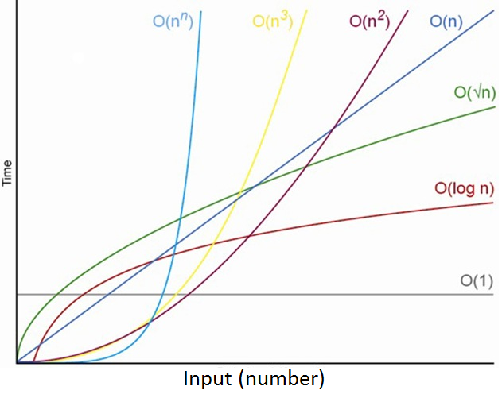

# 사견

알고리즘을 공부 안하면 SI 직행입니다. 단순코드 복붙합니다. 개발자로서 사고력을 함양할 수 없습니다.

메모리 효율적이거나 문제를 잘 해결하기 위해서는 자료구조와 알고리즘을 짝으로 알아야 합니다.

# 알고리즘

> 어떤 문제의 해결을 위하여, 입력된 자료를 토대로 하여 원하는 출력을 유도하여 내는 규칙의 집합. 여러 단계의 유한 집합으로 구성되는데, 각 단계는 하나 또는 그 이상의 연산을 필요로 한다.
>
> \- 표준국어대사전

간단하게는 문제를 해결하기 위한 유한한 절차의 합입니다.

알고리즘은 상황에 따라 효율성을 선택하는 기준이 다릅니다. 공간복잡성이 필요할 때와 시간복잡성이 필요할 때가 각각다릅니다.

자료구조와 알고르즘을 배우면 성능을 기준으로 좋은 코드와 나쁜 코드를 판단할 수 있습니다.

참고로 현업에서 일할 때는 이미 좋은 알고리즘이 다 구현되어 있습니다. 읽고 변형해서 사용하면 됩니다. 하지만 구현능력으로 개발자의 소양을 기르도록 합니다.


Algorithm Growth입니다. 알고리즘의 시간복잡성을 나타내는 Big-O 표기법 그래프입니다.

[Algorithm Analysis & Time Complexity Simplified - 미디엄 아티클 클릭하지마세요. 제한 걸려있습니다.](https://randerson112358.medium.com/algorithm-analysis-time-complexity-simplified-cd39a81fec71)

알고리즘 분석은 중요합니다. Algorithm analysis is an important part of a broader computational complexity theory, which provides theoretical estimates for the resources (space and time)needed by any algorithm which solves a given computational problem. <-- 나머지는 미래의 저가 번역해줄 것입니다.

보통 시간복잡성이라고 하면 컴퓨터가 작업을 수행한 횟수를 말합니다.

Big-O (O), Big Omega (Ω) and Big Theta (Θ)가 각각 존재합니다.

Big-O (O)는 최악의 경우 Big Omega (Ω)는 최고의 경우 Big Theta (Θ)는 최고와 최악의 평균입니다.

보통은 최악의 경우를 대응해줍니다. 하지만 현실에서 모든 최악의 경우를 대응하지는 않습니다. 대응할 때마다 발생할 수익성을 판단하고 대응합니다.

알고리즘 분석으로 모든 강의가 회귀할 것입니다. 그래서 알고리즘 분석을 대충하지 말도록 합니다. 소프트웨어 엔지니어의 수학적 소양은 기본 중 기본입니다.

사람들이 자주 착각하는 것이 있는데 자료구조와 알고리즘은 서로 독립적이지 않습니다. 서로 짝을 이룹니다.

목차

1. [과제 구현 능력](#과제-구현-능력)
2. [배열(Array)과 연결된 리스트(Linked List)](#배열과-연결된-리스트)
3. [정렬(Sort), 스택(Stack), 큐(Queue), 해쉬(Hash)](#정렬sort-스택stack-큐queue-해쉬hash)
4. [힙(heap), BFS, DFS, Dynamic Programming](#힙heap-bfs-dfs-dynamic-programming)
5. [종합 알고리즘 문제 풀이](#종합-알고리즘-문제-풀이)

## 과제 구현 능력

### 최대값 찾기

```py
def find_max_num(array):
    # 이 부분을 채워보세요!
    return 1


print("정답 = 6 / 현재 풀이 값 = ", find_max_num([3, 5, 6, 1, 2, 4]))
print("정답 = 6 / 현재 풀이 값 = ", find_max_num([6, 6, 6]))
print("정답 = 1888 / 현재 풀이 값 = ", find_max_num([6, 9, 2, 7, 1888]))
```

간단한 문제입니다. 내장함수를 사용하는 방법과 사용하지 않는 2가지 모두 구현하도록 합니다.

pep는 파이썬 스타일가이드입니다.

지정변수, 초깃값 설정 전략을 활용할 수 있습니다.

### 최빈값 찾기

`isalpha()` 문자열 메서드를 사용해서 alphabet a ~ z 대소문자 모두 해당하는 알파벳인지 파악합니다. 띄어쓰기, 특수문자, 숫자는 `False`를 반환합니다.

`ord()` 내장함수는 아스키 (ASCII) 코드의 10진값을 조회할 수 있습니다.

```py
def find_max_occurred_alphabet(string):
    # 이 부분을 채워보세요!
    return "a"

print("정답 = a 현재 풀이 값 =", find_max_occurred_alphabet("Hello my name is sparta"))
print("정답 = a 현재 풀이 값 =", find_max_occurred_alphabet("Sparta coding club"))
print("정답 = s 현재 풀이 값 =", find_max_occurred_alphabet("best of best sparta"))
```

### 시간복잡도

시간복잡도는 입력자료량과 처리시간 사이 상관관계입니다. 시간복잡도가 낮을수록 성능이 좋은 프로그램이라고 할 수 있습니다.

시간복잡도를 계산하는 방법입니다. <strong> 1줄을 연산이라고 생각하면 간단합니다. </strong> 실제로는 더 복잡할 수 있습니다. 하지만 1줄 중에 반복문은 계수로 표현합니다.

자료입력은 많은 경우 함수(메서드)인자를 주로 의미합니다.

O(N) 방식으로 표현하는 이유는 시간복잡성은 가변적인 입력자료를 받기 때문에 추상화한 것입니다.

중첩 반복문을 사용해서 문제를 해결할 수 있지만 사용하지 말아야 할 이유입니다.

```py
for num in array:              # array 의 길이만큼 아래 연산이 실행
    for compare_num in array:  # array 의 길이만큼 아래 연산이 실행
        if num < compare_num:  # 비교 연산 1번 실행
            break
    else:
        return num
```

$$
N_{num} \times N_{compare\ num}
$$

즉 하나의 $N$개의 배열 원소를 넣으면 $N^{2}$번의 연산을 합니다. $O(N^{2})$ 시간복잡성을 갖습니다. 극도로 비효율적입니다.

```py
for num in array:      # array 의 길이만큼 아래 연산이 실행
    if num > max_num:  # 비교 연산 1번 실행
        max_num = num  # 대입 연산 1번 실행
```

반면 단순 반복문은 지금 코드에서는 $O(2N)$ 시간복잡성을 갖습니다. 하지만 보통 상수는 무시합니다. 그리고 가장 높은차의 계수(이 예시의 경우 $2N$ 중 2)도 무시합니다.

시간복잡성에서 집중할 것은 차수입니다.

대부분의 경우 지불하는 비용은 공간복잡도를 지불하고 시간복잡도 성능을 개선하는데 사용합니다.

### 공간복잡도

공간복잡도는 입력자료량과 할당하는 메모리량 사이 상관관계입니다. 대부분의 경우 시간복자도가 더 중요합니다. 하지만 공간복잡도 문제도 많이 출제합니다. 시간복잡도를 먼저 공부하고 대비한 다음에 대비하기를 권장합니다.

```py
alphabet_array = ["a", "b", "c", "d", "e", "f", "g", "h", "i", "j", "k", "l", "m", "n", "o", "p", "q", "r", "s", "t", "u", "v", "x", "y", "z"]
# -> 26 개의 공간을 사용합니다
max_occurrence = 0 # 1개의 공간을 사용합니다
max_alphabet = alphabet_array[0]   # 1개의 공간을 사용합니다.

for alphabet in alphabet_array:
    occurrence = 0  # 1개의 공간을 사용합니다
```

위 코드는 모두 상수만큼의 공간복잡도를 갖습니다.

### 점근 표기법(asymptotic notation)

알고리즘의 성능을 수학적으로 표기하는 방법입니다. 알고리즘의 “효율성”을 평가하는 방법입니다. 점근 표기법(asymptotic notation)은 어떤 함수의 증가 양상을 다른 함수와의 비교로 표현하는 수론과 해석학의 방법이다.

점근 표기법은 함수의 증가양상을 간단하게 비교로 표기한 해석학과 수론의 방법론입니다.

#### 배열에서 특정 요소 찾기

```py
# Q. 다음과 같은 숫자로 이루어진 배열이 있을 때, 이 배열 내에 특정 숫자가 존재한다면 True, 존재하지 않다면 False 를 반환하시오.
def is_number_exist(number, array):
    # 이 부분을 채워보세요!
    return True


result = is_number_exist
print("정답 = True 현재 풀이 값 =", result(3,[3,5,6,1,2,4]))
print("정답 = Flase 현재 풀이 값 =", result(7,[6,6,6]))
print("정답 = True 현재 풀이 값 =", result(2,[6,9,2,7,1888]))
```

이런 알고리즘을 풀기 위해서 하는 것은 선형탐색입니다. 순서대로 값을 찾습니다. 순서대로 순회해야 합니다. 또 최악의 경우는 입력한 자료량만큼 순회해야 합니다. 이럴때는 $O(N)$에 해당합니다.

알고리즘은 입력값의 분포에 따라서 성능이 다를 수 있습니다.

알고리즘은 최악의 경우가 대부분입니다. 그래서 최악의 경우를 대응하기 위해서 $Big-O$ 표기법을 사용합니다.

### 곱하기 or 더하기

```py
# Q. 다음과 같이 0 혹은 양의 정수로만 이루어진 배열이 있을 때, 왼쪽부터 오른쪽으로 하나씩 모든 숫자를 확인하며 숫자 사이에 '✕' 혹은 '+' 연산자를 넣어 결과적으로 가장 큰 수를 구하는 프로그램을 작성하시오.

# 단, '+' 보다 '✕' 를 먼저 계산하는 일반적인 방식과는 달리, 모든 연산은 왼쪽에서 순서대로 이루어진다.
def find_max_plus_or_multiply(array):
    # 이 부분을 채워보세요!
    return 1


result = find_max_plus_or_multiply
print("정답 = 728 현재 풀이 값 =", result([0,3,5,6,1,2,4]))
print("정답 = 8820 현재 풀이 값 =", result([3,2,1,5,9,7,4]))
print("정답 = 270 현재 풀이 값 =", result([1,1,1,3,3,2,5]))
# 풀이의 시간복잡도는 무엇인가요?
```

### 반복되지 않는 문자

```py
# Q. 다음과 같이 영어로 되어 있는 문자열이 있을 때, 이 문자열에서 반복되지 않는 첫번째 문자를 반환하시오. 만약 그런 문자가 없다면 _ 를 반환하시오.
input = "abadabac"

def find_not_repeating_first_character(string):
    # 이 부분을 채워보세요!
    return "_"


result = find_not_repeating_first_character
print("정답 = d 현재 풀이 값 =", result("abadabac"))
print("정답 = c 현재 풀이 값 =", result("aabbcddd"))
print("정답 =_ 현재 풀이 값 =", result("aaaaaaaa"))
# 풀이의 시간복잡도는 무엇인가요?
```

반복의 기준이 홀수번 등장한 문자입니다.

### 숙제

#### 소수 나열하기

```py
# Q. 정수를 입력 했을 때, 그 정수 이하의 소수를 모두 반환하시오.
# 소수는 자신보다 작은 두 개의 자연수를 곱하여 만들 수 없는 1보다 큰 자연수이다.

input = 20  # output = [2, 3, 5, 7, 11, 13, 17, 19]

def find_prime_list_under_number(number):
    # 이 부분을 채워보세요!
    return []


result = find_prime_list_under_number(input)
print(result)
# 시간복잡성을 묘사하십시오.
```

```py
# Q. 0과 1로만 이루어진 문자열이 주어졌을 때, 이 문자열에 있는 모든 숫자를 전부 같게 만들려고 한다. 할 수 있는 행동은 문자열에서 연속된 하나 이상의 숫자를 잡고 모두 뒤집는 것이다. 뒤집는 것은 1을 0으로, 0을 1로 바꾸는 것을 의미한다.

# 예를 들어 S=0001100 일 때,

# 전체를 뒤집으면 1110011이 된다.
# 4번째 문자부터 5번째 문자까지 뒤집으면 1111111이 되어서 2번 만에 모두 같은 숫자로 만들 수 있다.
# 하지만, 처음부터 4번째 문자부터 5번째 문자까지 문자를 뒤집으면 한 번에 0000000이 되어서 1번 만에 모두 같은 숫자로 만들 수 있다.

# 주어진 문자열을 모두 0 혹은 모두 1로 같게 만드는 최소 횟수를 반환하시오.

input = "011110"

def find_count_to_turn_out_to_all_zero_or_all_one(string):
    # 이 부분을 채워보세요!
    return 1

result = find_count_to_turn_out_to_all_zero_or_all_one(input)
print(result)
# 시간복잡성을 묘사하십시오.
```

```py
# Q.
# 1. 입력으로 소문자의 알파벳 순으로 정렬된 문자열이 입력됩니다.
# 2. 각 알파벳은 중복이 가능합니다.
# 3. 중간에 없는 알파벳이 있을 수도 있습니다.

# 입,출력 예시와 같이 입력 문자열에 나타나는 각 알파벳의 종류,갯수를 요약하여 나타내시오.

def summarize_string(input_str):
    # 이 부분을 채워보세요!

input_str = "acccdeee"

print(summarize_string(input_str))
# 시간복잡성을 묘사하십시오.
```

## 배열(Array)과 연결된 리스트(Linked List)

자료구조마다 효율적인 알고리즘이 각각 다릅니다. 프로그램에서 문제를 해결하는 또 다른 도구입니다.

연결된 리스트는 값과 다음 노드를 지정하는 방식입니다.

### 배열

배열은 크기가 정해진 연속된 데이터의 공간입니다.

## 정렬(Sort), 스택(Stack), 큐(Queue), 해쉬(Hash)

## 힙(heap), BFS, DFS, Dynamic Programming

## 종합 알고리즘 문제 풀이

## 문제풀이 접근 방법

알고리즘 문제를 풀다보면, 문제 자체를 이해하기 힘들 때가 있습니다.

코드부터 작성하지 않습니다. 다른 케이스들의 규칙성을 파악하기 바랍니다.

배웠던 자료구조와 알고리즘 중 무엇으로 해결할 수 있는지 파악해봅니다.

문제의 특징을 하나식 글로 작성해봅니다.

수학적 성질 혹은 개념을 응용합니다. 평소 수학관련 교양을 쌓도록 합니다.

특정숫자의 특징 혹은 성질을 늘고민합니다.

문제를 독해할 때 무엇을 반환해야 하는지 유심히 읽어봅니다. 자료에 변형을 가한 그 자체인지 자료에 변형을 가하기 위한 횟수가 몇번진 등 간접적일 수 있습니다.
